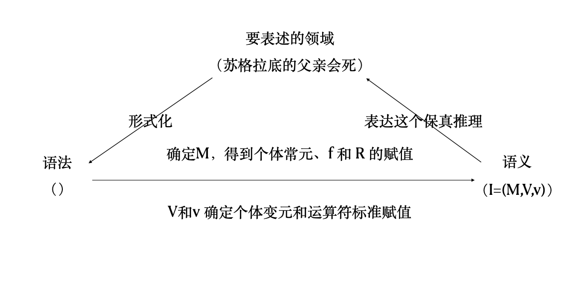

# Summary for 数理逻辑

by 鸢一折纸

#### 为什么要有谓词演算？命题演算不是很好很完备嘛？

逻辑学的一个目的是将数学乃至于现实世界形式化，而命题演算 (L系统) 不足以表达所有的保真推理所依据的逻辑结构，因此需要更细致的语言，描述原子命题的内部结构，并引进量词运算

后面对于 K$^+$ 和 K$_N$ 的引入 (待续)

#### 关于函数符号 $f$ (运算) 和谓词符号 $P$ (关系) 

函数符号构成项，谓词符号连接项而形成公式

函数符号更多的是描述这个个体变元/常元的attribute，而谓词符号是描述relationship

#### 关于Trump会不会飞的问题……

- 原题如下：$\Gamma=$ {鸟会飞，死鸟不会飞，Trump是鸟，Trump是死鸟}，得到 $\Gamma\vdash$ 特朗普会飞
- 为啥呢，因为前提集不相容……
- 大致证明如下：$f(x)$ 表示$x$是鸟，$g(x)$ 表示$x$是死鸟，$H(x)$ 表示$x$会飞
	- 已知：$\Gamma=\{\,\forall x\,(f(x)\to H(x)),\ \forall x\,(g(x)\to H(x)),\ f(y),\ g(y)\,\}$
	- 如果默认死鸟是鸟 ($p$)，那么由前提集 $\Gamma'=$ {鸟会飞，死鸟不会飞，特朗普是死鸟} 可以用归谬律证明 $\Gamma'\vdash\neg p$，理由如下：
		- $\forall x(g(x)\to f(x))$ 死鸟是鸟
		- $g(x)\to f(x)$ K4+MP,1,1.5
		- $f(x)\to H(x)$ 鸟会飞+K4
		- $g(x)\to H(x)$ HS,2,3
		- $g(x)\to\neg H(x)$ 死鸟不会飞+K4
		- $g(x)$ 特朗普是死鸟
		- 由MP规则，有 $\Gamma'\cup p\vdash H(x)$ 和 $\Gamma'\cup p\vdash\neg H(x)$
		- 再由归谬律可知 $\Gamma'\vdash\neg p$
	- 如果没有这个默认条件，那么加上特朗普的条件，就有：$y$ 为表示Trump的个体变元
		- $f(y)$ Trump is a bird
		- $\forall x(f(x)\to H(x))$ Birds can fly
		- $\forall x(f(x)\to H(x))\to (f(y)\to H(y))$ K4
		- $f(y)\to H(y)$ 2, 3, MP
		- $H(y)$ 1, 4, MP
		- $\neg H(y)$ 同理可证
		- 故前提集不相容

#### 关于否定肯定律的直接证明 (from yqy)

- 首先受到书上运用演绎定理的启发，并结合演绎定理的证明，再稍作改进
- 由否定前件律：$\neg p\to(p\to\neg q)$，其中q为任意公式，这个的证明需要7步 (*P21*)
- 再用L2和MP有：$(\neg p\to p)\to(\neg p\to\neg q)$，这是第九步
- 再有L3，第10步
- 直接证明HS需要5步，之后有：$(\neg p\to p)\to(q\to p)$，这里是第十五步
- L2和MP之后有：$((\neg p\to p)\to q)\to((\neg p\to p)\to p)$，这里是第十七步
- 因此只需要构造 $(\neg p\to p)\to q$ 为内定理，就可以在19步内得到证明，取 $q=p\to(\neg p\to p)$ 即可 (L1)

$$
\begin{align}
&\neg p\to(\neg\neg(p\to(\neg p\to p))\to\neg p) \tag{L1}\\
&(\neg\neg(p\to(\neg p\to p))\to\neg p)\to(p\to\neg(p\to(\neg p\to p))) \tag{L3}\\
&((\neg\neg(p\to(\neg p\to p))\to\neg p)\to(p\to\neg(p\to(\neg p\to p))))\to((\neg p\to(\neg\neg(p\to(\neg p\to p))\to\neg p)\to(p\to\neg(p\to(\neg p\to p)))))\tag{L1}\\
&\neg p\to((\neg\neg(p\to(\neg p\to p))\to\neg p)\to(p\to\neg(p\to(\neg p\to p))))\tag{2,3,MP}\\&\dots
\end{align}
$$

用 q 替代，简化书写，考试的时候不一定可以这么用……看老师心情 (bushi)

$$
\begin{align}
&(1)\quad\neg p\to(\neg\neg q\to\neg p)\tag{L1}\\
&(2)\quad(\neg\neg q\to\neg p)\to(p\to\neg q)\tag{L3}\\
&(3)\quad((\neg\neg q\to\neg p)\to(p\to\neg q))\to(\neg p\to((\neg\neg q\to\neg p)\to(p\to\neg q)))\tag{L1}\\
&(4)\quad\neg p\to((\neg\neg q\to\neg p)\to(p\to\neg q))\tag{2, 3, MP}\\
&(5)\quad(\neg p\to((\neg\neg q\to\neg p)\to(p\to\neg q)))\to((\neg p\to(\neg\neg q\to\neg p))\to(\neg p\to(p\to\neg q)))\tag{L2}\\
&(6)\quad(\neg p\to(\neg\neg q\to\neg p))\to(\neg p\to(p\to\neg q))\tag{4, 5, MP}\\
&(7)\quad\neg p\to(p\to\neg q)\tag{1, 6, MP}\\
&(8)\quad(\neg p\to(p\to\neg q))\to((\neg p\to p)\to(\neg p\to \neg q))\tag{L2}\\
&(9)\quad(\neg p\to p)\to(\neg p\to\neg q)\tag{7, 8, MP}\\
&(10)\ \ (\neg p\to\neg q)\to(q\to  p)\tag{L3}\\
&(11)\ \ ((\neg p\to\neg q)\to(q\to  p))\to((\neg p\to p)\to((\neg p\to\neg q)\to(q\to  p)))\tag{L1}\\
&(12)\ \ (\neg p\to p)\to((\neg p\to\neg q)\to(q\to  p))\tag{10, 11, MP}\\
&(13)\ \ ((\neg p\to p)\to((\neg p\to\neg q)\to(q\to  p)))\to(((\neg p\to p)\to(\neg p\to\neg q))\to((\neg p\to p)\to(q\to p)))\tag{L2}\\
&(14)\ \ ((\neg p\to p)\to(\neg p\to\neg q))\to((\neg p\to p)\to(q\to p))\tag{12, 13, MP}\\
&(15)\ \ (\neg p\to p)\to(q\to p)\tag{9, 14, MP}\\
&(16)\ \ ((\neg p\to p)\to(q\to p))\to(((\neg p\to p)\to q)\to((\neg p\to p)\to p))\tag{L2}\\
&(17)\ \ ((\neg p\to p)\to q)\to((\neg p\to p)\to p)\tag{15, 16, MP}\\
&(18)\ \ (\neg p\to p)\to(p\to (\neg p\to p))\tag{L1}\\
&(19)\ \ (\neg p\to p)\to p\tag{17, 18, MP}
\end{align}
$$

附：直接证明可以借鉴的思路 (不保证管用)

- 遇事不决先把三个公理都试一遍
- L1负责把已知公式变成蕴含词后件
- 对于子公式形式不变改变顺序的，L1接L2会有奇效
- 无从下手的时候想办法把公式里面的子公式换掉 (可以先空着写成 $\large\circ$)，会看起来简洁一些
	- 比如把里面的某一个 p 换成 q 什么的…

附：HS、双否律、第二双否律、换位律直接证明略缩版

**HS**

$$
\begin{align}&(1)\quad(q\to r)\to(p\to(q\to r))\tag{L1}\\
&(2)\quad p\to(q\to r)\tag{MP}\\
&(3)\quad(p\to q)\to(p\to r)\tag{L2, MP}\\
&(4)\quad p\to r\tag{MP}
\end{align}
$$

**双否律**

$$
\begin{align}
&(1)\quad\neg\neg p\to\neg\neg p\tag{同一律 , P21}\\
&(2)\quad\neg\neg p\to(\neg\neg\neg\neg p\to\neg\neg p)\tag{L1}\\
&(3)\quad\neg\neg p\to(\neg\neg p\to p)\tag{(L3+HS)*2}\\
&(4)\quad\neg\neg p\to p\tag{L2,MP}
\end{align}
$$

**第二双否律**

前面同双否律，只是所有的 $p$ 换为 $\neg p$，然后最后

$$
\begin{align}&
(1)\quad\neg\neg\neg p\to\neg p\tag{双否律 }\\
&(2)\quad p\to\neg\neg p\tag{1, L3, MP}\end{align}
$$

**换位律**

演绎定理最简单：$\{q\to p\}\vdash\neg p\to\neg q$

$$
\begin{align}
&(1)\quad q\to p\tag{已知 }\\
&(2)\quad \neg\neg q\to q\tag{双否律 }\\
&(3)\quad\neg\neg q\to p\tag{1, 2, HS}\\
&(4)\quad p\to\neg\neg p\tag{第二双否律 }\\
&(5)\quad MP, L3, MP\end{align}
$$

不用演绎定理：

$$
\begin{align}
&(1)\quad\neg\neg p\to p\tag{双否律 }\\
&(2)\quad(p\to q)\to(\neg\neg p\to p)\tag{L1, MP}\\
&(3)\quad(p\to q)\to(\neg\neg p\to(p\to q))\tag{L1}\\
&(4)\quad(p\to q)\to((\neg\neg p\to p)\to(\neg\neg p\to q))\tag{L2, HS}\\
&(5)\quad(p\to q)\to(\neg\neg p\to q)\tag{L2, 2, MP}\\
&(6)\quad q\to\neg\neg q\tag{第二双否律 }\\
&(7)\quad\neg\neg p\to(q\to\neg\neg q)\tag{L1, MP}\\
&(8)\quad(p\to q)\to(\neg\neg p\to\neg\neg q)\tag{5, L2, MP}\\
&(9)\quad(p\to q)\to(\neg q\to\neg p)\tag{8, L3, HS}
\end{align}
$$

#### 从一阶演算的M有效说起

先来看一下逻辑的语义，这个我觉得有一点套娃，所以先从命题演算L说起

先看L里面有什么：命题变元和联结词 (以及由这两个构成的公式)。所以如果想要确定一个L公式的真值，需要给这两个都有赋值，而这两个都是定义在 $F_2$ 域上的。

然后在来看一下K的缘起：K是把L里面的原子公式，也就是命题变元拆开来看其内部结构 (P62，Line11)，在谓词演算系统K里面，“项” 再加上项与项之间的关系，即原子公式，对应原来L中的命题变元。而项内部有个体变元、个体常元和运算符 (注意闭项的概念里面没有个体变元，但闭式是有可能有的)。

如PPT ch2.2 所言：个体是数学中“数”的推广，函数将被解释为个体到个体的映射。项将被解释为个体。例如，$g(x)$ 是从人到人的映射，所以 $g(s)$ 也是一个人。谓词将被解释为个体到真值的映射。不含个体变元的公式将为解释为命题，含个体变元的公式将被解释为命题函数

那么现在回来看对K的语义赋值：三元组 $\mathbf{I(M,V,\nu)}$。相应于L，在原子公式这个层次上，有对于整个**原子公式**真值的定义V和$\nu$，其中V是对于变元真值的定义，$\nu$是对于联结词真值的定义。那么为什么还会有M呢？因为在K中，变元、常元都不再限制于 $F_2$ 域，而是根据具体的被抽象为逻辑的领域而赋值 (比如我要是研究初等数论的形式化(当然这个需要K$^+$的)，赋值范围就是整个自然数集$\N$了)。所以我们就需要对这个 “原子” 内部的夸克 (变元和常元) 和胶子 (函数和谓词) 来确定一个定义域，也就是三元组 $\mathbf{M(D,F,P)}$，即变/常元取值域、可用项结构集合、不同项之间可能的关系集合。给定了解释域M，K中只涉及闭项的原子公式便有了实际意义，立即可以解释为关于积集 $M=D\times F\times P$ 的元素的命题 (P82，Line11)。

注意M是集合！是集合！是集合！M本身不是映射关系，只是一个定义域，常元、函数和关系是这个定义域所表达的那个

借鉴面向对象的思路来讲，解释一个系统 (L、K、K$^+$、K$_N$) 就像定义一个类。这个类里面需要有预定义的固定的参数 (常元、标准解释的联结词)，有抽象的成员变量 (变元，在实例化的时候作出实际的映射赋值)，有成员方法 (公理、公设、推理规则)。然后我现在找这个结构的一个语义解释M，就相当于在实际定义这个类。论域就是确定了常元和变元的取值范围 (定义域)，函数集合定义了有关常元和变元(构成命题的项)的运算规则 (可以理解为是一个*值*) ，关系集合定义了项与项之间*可以真也可以假*的相对关系的*判断*。所以借助一个if判断句来说，`if(公式)`就比如`if(R( f(a1,c1,a2), c2 ))`，就相当于`y=f(a1,c1,a2)`在加上`if(R(y,c2))`。项是一个整体，在语义的真值判断中，和单独的一个变元、常元（实际上也是项）的地位是相当的

#### 关于L的可判定性

在ch1.7的PPT里面，这样写道：THM: (命题演算的可判定性) 存在一个能行方法A，对任何L公式p，当 $\vdash p$ 成立时，A可以在有效时间内回答YES；当 $\vdash\neg p$ 成立时，A可以在有效时间内回答NO

不过，对于 $\Gamma\vdash p$，就不是可判定的了，因为当 $\Gamma$ 为无穷集时，¬p就不能在有限时间内判定出来

而且，K $\vdash p$ 是半可判定的

#### 关于个体变元和命题变元

个体变元是在一阶逻辑中用的，命题变元，即命题符号，是在命题演算里面的

#### 关于逻辑联结词和等词的优先级

即 $\neg,\to,\vee,\wedge,\leftrightarrow,\approx$ 这几个

按照优先级从高到低排序是 $\neg,\vee,\wedge,\to,\leftrightarrow,\approx$

#### 一个实际问题变成一阶谓词演算的

（题外话：我觉得其实有人加课程群讨论点问题可以接受的诶……虽然不同学校讲的确实不太一样 $>\_<$

任何军官都喜欢他表扬的每一个士兵；任何军官都不喜欢每一个怕死的士兵；所以，每一个被有些军官表扬的士兵是不怕死的

军官：$x_1$ ；士兵：$x_2$

a表扬b：$R_1(a,b)$ ；a喜欢b：$R_2(a,b)$ ；a怕死：$R_3(a)$

$p: \forall x_1\forall x_2\,(R_1(x_1,x_2)\to R_2(x_1,x_2))$

$q: \forall x_1\forall x_2\,(R_3(x_2)\to\neg R_2(x_1,x_2))$

$r:\forall x_2\,(\exists x_1R_1(x_1,x_2)\to\neg R_3(x_2))$

求证：$\{p,\,q\}\vdash r$

$pf.$ (略去 $MP$ 步)

易知 $r\leftrightarrow\forall x_2\forall x_1\,(R_1(x_1,x_2)\to\neg R_3(x_2))$

对 $p,q$ 各一次 $K4$，得到 $p_1: R_1(x_1,x_2)\to R_2(x_1,x_2),\quad q_1: R_3(x_2)\to\neg R_2(x_1,x_2)$

对 $q_1$ 用一次换位律得到 $\neg\neg R_2(x_1,x_2)\to\neg R_3(x_2)$

由第二双否律和 $HS$ 得到 $R_2(x_1,x_2)\to\neg R_3(x_2)$

再由 $HS$ 得到 $r_1:R_1(x_1,x_2)\to\neg R_3(x_2)$

对 $r_1$ 用两次 $\mathrm{Gen}$ 得到 $\forall x_2\forall x_1\,(R_1(x_1,x_2)\to\neg R_3(x_2))$，证毕

#### 关于一些相似的证明定理

有几个相近的定理，需要注意一下不要搞混了：

$L3$ 和换位律：去 $\neg$ 和添 $\neg$

反证律和归谬律：前提集加 $\neg p$ 和加 $p$

双否律和第二双否律：去 $\neg\neg$ 和添 $\neg\neg$

$\exists$ 的定义：$\neg\forall x\neg p=\exists xp$，而 $\neg\exists x\neg p=\forall xp$ 需要 $K4$ 和两次双否律，以及 Gen

注意 $K4,K5$ 是有额外要求的：$K4$ 要求项 $t$ 对 $p(x)$ 中的 $x$ 是自由的，$K5$ 要求 $x$ 不在 $p$ 中自由出现

$K$ 中的演绎定理，$\varGamma\cup\{p\}\vdash q\Rightarrow\varGamma\vdash p\to q$ 的方向要求证明所用 $\mathrm{Gen}$ 变元 (在证明序列中，$p_k=\forall xp_j$，$x$ 就是 $\mathrm{Gen}$ 变元) 不在 $p$ 中自由出现

#### 关于自由出现

不出现也是不自由出现（P66 line4）。在判断自由出现时，如 $x_i$ 有多少个是自由出现的，$\forall x_i$ 里面的 $x_i$ 也要计算在内。写 $p(x)$ 时是指该公式中自由出现的 $x$，但写 $p(x)$ 时 $x$ 可以不在 $p(x)$ 中自由出现或者根本不出现（P66 para4）。

#### 关于 K 和 L

在 $L$ 里面，永真式就是内定理，但在 K 中，永真式只是内定理的一部分。我觉得 $K$ 里面和 $L$ 永真式概念对应的应该是逻辑有效吧 $\models p$

演绎定理、反证律、归谬律的区别 (Gen 变元不在p自由出现)

任给公式p是不是K的内定理是**半可判定的**，和L中不一样

#### 关于项解释的变元变通

对任何公式$p$和个体变元$x$，$I(\forall xp) =\begin{cases}t,\quad if\ for\ all\ d\in D,\ there\ is\ I_{x/d} (p)=t;\\f,\quad else.\end{cases}$

1. 其中$I$的变体 $I_{x/d}$ 由V的变体 $V_{x/d}$ 构成：$I_{x/d} =_{df} (M, V_{x/d} , \nu)$， $V_{x/d} (y) =_{df}\begin{cases}d,\qquad if\ y=x;\\V(y),\,\ if\ y\neq x.\end{cases}$
2. 这个在书上叫：项解释的变元变通
	1. 首先，对于固定的解释域M，把所有的项解释组成的集合记为 $\Phi_M$
	2. x是给定的个体变元，y是任意的个体变元，对于 $\varphi,\varphi'\in\Phi_M$，满足条件 $y\neq x\Rightarrow\varphi'(y)=\varphi(y)$，此时 $\varphi$ 和 $\varphi'$ 互为对方的 x 变通
3. $^{eg.}$依一阶解释的定义，$\forall xP(x, c)$ 为真，当且仅当对所有自然数$d\in D$，变体解释 $I_{x/d} (P(x, c))=t$

由定义知，互为 $x$ 变通的 $\varphi$ 和 $\varphi'$ 的差别仅在于对变元 $x$ 的指派可能不同（也可能相同）而他们对其他变元的指派全都相同（有没有想到 $\delta$ 函数的感觉）

这么定义，是要验证 $\forall x$ 的缘故，就需要将 $x$ 取遍定义域，且只改变 $x$ 的值

