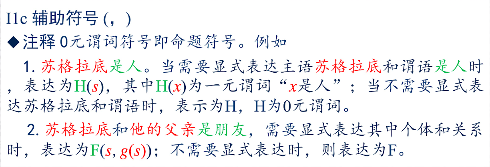
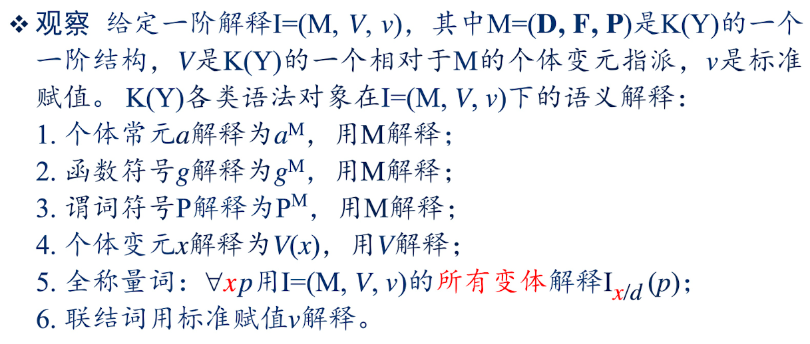
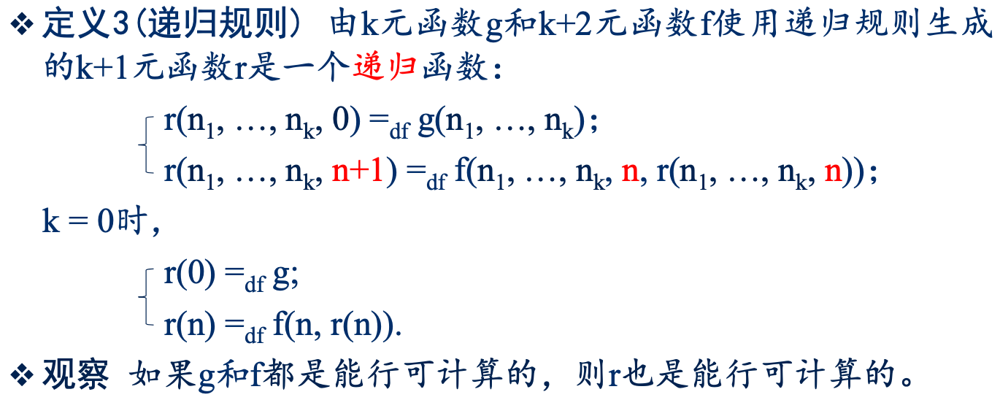
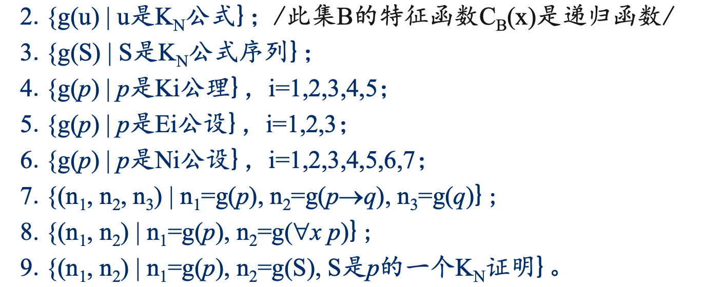

# 数理逻辑

by 鸢一折纸

此文档按照陈教授的课件顺序来编排，与课本有一些出入（包括部分符号系统）

## 零、导论

- 演绎推理
	- 性质1(保真性）在演绎推理中，如果推理前提是真的，则结论一定是真的
	- 保真性是推理的前提与结论之间的一种真值关系——如果前提真，则结论保持前提的真
- 归纳推理
	- 性质2(保假性）在归纳推理中，如果结论是假的，则推理前提一定是假的
- 类比推理（既不保真，也不保假）
- 演绎推理的形式正确性：推理有效性（即保真性）
- 演绎推理的外延性：演绎推理的有效性与推理内容无关

>观察: 演绎推理的有效性/保真性不要求推理前提一定是真的，也不考虑前提/结论的内容的合理性

有一个特朗普会不会飞的例子emm（第二章处理）

## 一、命题演算

### 1.1 命题与联结词

- 命题逻辑的构成：命题演算（语法）、命题语义学、命题逻辑元理论（语法语义关系）
- 观察：命题的界定以矛盾律、排中律为前提

### 1.2 命题演算$L$

**注意符号和命题符号不一样！！！**

- 符号表
	- 命题符号/命题变元：$x_1,x_2,\dots$（可数无穷多个）
	- 基本联结词：$\neg,\to$
- 公式
	- 原子公式，否定式，蕴含式
	- 有限次应用以上步骤
	- $L(X)$ 的分层性
- 公理模式
	- $(L1)\quad p\to(q\to p)$
	- $(L2)\quad(p\to(q\to r))\to((p\to q)\to(p\to r))$
	- $(L3)\quad(\neg p\to\neg q)\to(q\to p)$
	- 推理规则$(MP)$：$\{p,\,p\to q\}\vdash q$（分离规则）
- 形式证明、内定理、形式推理

### 1.3 命题演算的简单性质

- 单调性
	- 若 $\Gamma\subseteq\Gamma'$ 且 $\Gamma\vdash p$，则 $\Gamma'\vdash p$；特别地，若 $\vdash p$，则对任何 $\Gamma$，$\Gamma\vdash p$
- 紧致性
	- 若 $\Gamma\vdash p$，则存在有穷集 $\Gamma'\subseteq\Gamma,\,s.t.\,\Gamma\vdash p$
	- 紧致性是自动推理的必要条件
- 平凡性
	- 若 $\Gamma$ 是不相容的，则对于任何 $p$ 有 $\Gamma\vdash p$
- 演绎定理
	- $\Gamma\cup\{p\}\vdash q$ 当且仅当 $\Gamma\vdash p\to q$
		- （推论）假设三段论$(HS)$：$\{p\to q,\,q\to r\}\vdash p\to r$
- 反证律
	- 若 $\Gamma\cup\{\neg p\}\vdash q$ 且 $\Gamma\cup\{\neg p\}\vdash\neg q$，则 $\Gamma\vdash p$
- 归谬律
	- 若 $\Gamma\cup\{p\}\vdash\ q$ 且 $\Gamma\cup\{p\}\vdash\neg q$，则 $\Gamma\vdash\neg p$
- 不知道叫什么律，证明可能用到思路
	- $\vdash(p\to q)\to(p\to p)$（书 P21）
	- $(p\to(q\to r))\to(q\to(p\to r))$（书 P22）
	- $\lnot(p\to q)\to(q\to p)$（书 P25）
- 同一律（书 P21）
	- $\vdash p\to p$
- 否定前件律（书 P21）
	- $\neg q\to(q\to p)$
- 否定肯定律（书 P24，19步直接证明）
	- $\vdash(\neg p\to p)\to p$
- 换位律（作业）（注意和 L3 不要搞混了）
	- $(q\to p)\to(\neg p\to\neg q)$
- Peirce律（作业）
	- $((p\to q)\to p)\to p$
- 双重否定律（作业）
	- $\vdash\neg\neg p\to p$
- 第二双重否定律（作业）
	- $\vdash p\to\neg\neg p$
- 可证等价替换规则
	- 设q是p的子公式，$q'$是任意公式，公式$p'$是在p中用$q'$替换q的结果，若 $\vdash q\to q'$ 且 $\vdash q'\to q$，则 $\vdash p\to p'$ 且 $\vdash p'\to p$
- L扩展：定义连接词
	- $p\vee q=_{d\!f}\neg p\to q$
	- $p\wedge q=_{d\!f}\neg(p\to\neg q)$
	- $p\leftrightarrow q=_{df}(p\to q)\wedge(q\to p)$
	- 性质
		- $\vdash p\to(p\vee q)$ 引入律
		- $\vdash q\to(p\vee q)$
		- $\vdash(p\vee q)\to(q\vee p)$
		- $\vdash(p\vee p)\to p$ 幂等律，即否定肯定律
		- $\vdash\neg p\vee p$ 排中律
		- 合取词和等值词的性质见P29命题2，命题3

### 1.4 命题演算的语义

- 形式语义：在外延性原则之下，给L的所有语法对象赋予真值意义，包括:命题变元、联结词、公式、内定理、形式推理
- 真/假：代表抽象的真假，其中真假的含义没有具体规定 (形式语义)
- 指派——命题变元的语义解释：L(X)的一个指派是一个映射 $v_0:X\mapsto\{t,f\}$
- 赋值——联结词的解释原则：L(X)的一个赋值是对联结词左右抽象真值关系的映射
- 标准赋值：$v(\neg)=_{d\!f}f_\neg,\ v(\to)=_{d\!f}f_\to$
- 命题语言的(标准)解释：$I(v_0,v)$ 中$v_0$可变，$v$固定公式的真值也随$v_0$而变
- 命题逻辑中，一个公式在语法（演算L）中视为一个符合形成规则的表达式；而在语义(L的语义解释)中视为一个真值函数
- 成真、成假指派，重言式、矛盾式、偶然式（相对于所有指派，任何公式只能是上述三种公式之一； 在任意给定的一个指派下，任何公式只有两种真值之一）

### 1.5 公式集的逻辑结构

- 无限集 $L(X_n)$ 只有有限多个语义不同的公式
	- 观察：L的语法描述比语义描述的粒度更细
- 范式

### 1.6 命题演算的可靠性和完全性

可靠性（语义一致性）：对所有 $p$ 和 $\Gamma$，若 $\Gamma\vdash p$，则 $\Gamma\models p$

推论（无矛盾性、语法一致性）：不存在公式 $p$，使得 $\vdash p$ 且 $\vdash\neg p$

相容集、极大相容集（若 $L$ 公式集 $\Gamma$ 相容，且对任何 $L$ 公式 $q$ 有 $\Gamma\vdash q$ 或者 $\Gamma\vdash\neg q$）

语义完全性：对任何 $p$ 和 $\Gamma$，若 $\Gamma\models p$，则 $\Gamma\vdash p$

### 1.7 命题逻辑的判定问题

判定问题：称一类问题是可判定的，如果：

1. 该类问题的每一个实例只有“是”与“否”两种回答；
2. 存在一个“能行”方法/过程A，使得对该类问题的每一个实例，A都在有限时间内给出正确的回答

## 二、谓词演算

### 2.1 命题内部结构的一阶表达

### 2.2 一阶谓词演算 K 的构成

- 逻辑符号（仅代表逻辑概念，其含义不随应用领域而改变）
	- 个体变元：$x_1,x_2,\cdots$（可数无穷多个）
	- 基本联结词：$\lnot,\to$
	- 量词：$\forall$
- 非逻辑符号
	- 个体常元：$c_1,c_2,\cdots$（可数或有限个）
	- 函数符号：$f_i^n$，代表 n 元运算(Loading)（可数或有限个）
	- 谓词符号：$P_i^n$，代表个体对象集上的 n 元关系，（可数或有限个）至少要有一个
		- 注释：0元谓词符号即命题符号；也就是说，省略了里面的个体和关系不表达出来
		- 

#### 项

1. 个体变元和个体常元是项；
2. 若g是n元函数符号，t1, t2, …, tn是项，则g(t1, t2, …, tn)是项；
3. 只有经过有限次应用以上步骤生成的是项

> 注释：个体是数学中“数”的推广；函数将被解释为个体到个体的映射；项将被解释为个体。例如，$g(x)$ 是从人到人的映射，所以 $g(s)$ 也是一个人

- 闭项
	- 只含个体常元的项

#### 公式

1. 若P是 $n(n≥0)$元谓词符号， $t_1, t_2, …, t_n$ 是项，则 $P(t_1, t_2, …, t_n)$ 是
公式，称为原子公式；
2. 若p，q是公式，则$¬p$和$p\to q$是公式，分别称为否定式和蕴涵式；
3. 若p是公式， x是个体变元，则$\forall xp$是公式，称为量化公式；
4. 只有经过有限次应用以上步骤生成的是公式。

>注释：谓词将被解释为个体到真值的映射；不含个体变元的公式将为解释为命题；含个体变元的公式将被解释为命题函数

- 原子公式
	- 形如 $R_i^n(t_1,\cdots,t_n)$

#### 公理模式

$K_1\sim K_5$，前三条与 L 中的一样，第四个是去掉全称量词，第五个是把全称量词放到蕴含词的后项上

$K4:\forall xp(x)\to p(t)$

$K5:\forall x(p\to q)\to(p\to\forall xq)$

注意 $K4,K5$ 是有额外要求的：$K4$ 要求项 $t$ 对 $p(x)$ 中的 $x$ 是自由的，$K5$ 要求 $x$ 不在 $p$ 中自由出现

#### 推理规则

MP 和 UG（添加全称量词）

#### 定义

- $p\vee q=_{df}¬p\to q$
- $p\wedge q=_{df}¬(p\to ¬q)$
- $p\leftrightarrow q=_{df}(p\to q)\wedge(q\to p)$
- $\exists xp=_{df}¬\forall x¬p$（全称量词与存在量词对偶）

#### 变元的自由出现和约束出现

约束：在 $\forall x$ 或其范围中；

自由：不是约束

闭式：公式中不含自由出现的变元

#### 自由代换

- 项 t 对p(x)中 x 自由：如果K公式p(x)中个体变元x有自由出现，用项t处处同时替换x在p(x)中的每一个自由出现，所得结果记为p(t)。若t中的个体变元在p(t)中的出现都是自由的，则称项t对p(x)中x自由。
- 这两种情形是自由的：
	- t 是闭项
	- x 没有在 p 中自由出现
- 另一种说法是：若对项 t 中所含任一变元 y，p 中自由出现的某变元 x 全都不出现在 p 中 $\forall y$ 的范围中，则说 t 对 p 中 x 是自由的

### 2.3 一阶谓词演算K的形式推理

- 推理规则：公理、前提集、MP、Gen（这一步用到的变元称为Gen变元）
- 形式证明：前提集为 ø
- 公式集：K的全体公式的集合记为 $K(Y),Y=\{y_1,y_2,\cdots\}$是K的全体个体变元的集合
- 定理(K和L的关系)：设 $p(x_1,\cdots,x_n)\in L(X_n),\ q1_,\cdots,q_n\in K(Y)$。如果$\vdash_L p(x_1,\cdots,x_n)$，则$\vdash_K p(q_1,\cdots,q_n)$
- 命题演算型永真式，简称永真式：是 L 里面的永真式就是 K 里面的命题演算型永真式
- K 的简单性质以及一些定理：
	- 单调性：若$\Gamma\subseteq\Gamma'$且$\Gamma\vdash_K p$则$\Gamma'\vdash_K p$
	- 紧致性
	- 平凡性
	- 重要 $\exists_1$规则：设项 t 对 p(x) 中的x自由，则有：$\vdash p(t)\to\exists xp(x)$
	- 演绎定理：注意 $\Gamma\cup\{p\}\vdash q\Rightarrow\Gamma\vdash p\to q$ 的方向（前提变前件），需要满足证明所用 Gen 变元不在 p 中自由出现，特别地，当 p 是闭式时没这个限制条件了
	- K反证律
	- K归谬律
	- 也常用 $\exists_2$规则：设 $\Gamma\cup\{p\}\vdash_Kq$ 且该推理中的概括变元(Gen)不在p中自由出现。若x不在q中自由出现，则 $\Gamma\cup\{\exists xp\}\vdash_Kq$

### 2.4 可证等价和前束范式

- 可证等价：若 $\Gamma\vdash_Kp\leftrightarrow q$，则称 p 和 q 在 $\Gamma$ 下可证等价；若 $\Gamma=\varnothing$，则称p与q可证等价，记为 $\vdash_Kp\leftrightarrow q$
- 几个性质
	- 自反性 $\vdash p\leftrightarrow q$
	- 对称性 $\vdash p\leftrightarrow q\Rightarrow\,\vdash q\leftrightarrow p$
	- 可递性 $\vdash p\leftrightarrow q$ 且 $\vdash q\leftrightarrow r\Rightarrow\,\vdash p\leftrightarrow r$
- 观察：可证等价是集合 K(Y) 上的一个等价关系
- 约束变元起的作用类似于积分变元：
	- $\vdash\forall xp(x)\leftrightarrow\forall yp(y)$
	- $\vdash\exists xp(x)\leftrightarrow\exists yp(y)$
- 定理(子公式等价可替换性)：设q是p的子公式，用$q’\in K(Y)$替换p
	中q的一次出现所得结果记为p’。如果 $\vdash_Kq\leftrightarrow q’$，则 $\vdash_K p\leftrightarrow p’$
- 对偶式：设 $p\in K(Y)$ 只出现原子公式以及 $\neg,\vee,\wedge,\forall,\exists$，互换
	- 对偶律：$\vdash_K\neg p\leftrightarrow p^*$
- 前束范式：母式：把量词都扔前面
	- 定理：令 Q* 为 Q 的对偶量词
		- 改名：若y不在p(x)中出现，则 $\vdash Qxp(x)\leftrightarrow Qyp(y)$
		- 量词外移：
			- 若x不在p中自由出现，则 $\vdash(p\to Qxq)\leftrightarrow Qx(p\to q)$
			- 若x不在q中自由出现，则 $\vdash(Qxp\to q)\leftrightarrow Q^*x(p\to q)$
			- $\vdash ¬Qxp\leftrightarrow Q^*x¬p$
			- $\vdash(\forall xp\land\forall xq)\leftrightarrow\forall x(p\wedge q)$
			- $\vdash(\exists xp\vee\exists xq)\leftrightarrow\exists x(p\vee q)$
			- 若x不在p中自由出现，则 $\vdash(p\vee Qxq)\leftrightarrow Qx(p\vee q)$
			- 若x不在p中自由出现，则 $\vdash(p\wedge Qxq)\leftrightarrow Qx(p\land q)$
		- 合取和析取：
			- $p\vee q=_{df}\neg p\to q$
			- $p\wedge q=_{df}\neg(p\to\neg q)$
			- $p\leftrightarrow q=_{df}(p\to q)\wedge(q\to p)$
			- $\exists xp=_{df}\neg\forall x\neg p$
	- （没讲，在书P80）$\Pi_n$ 和 $\Sigma_n$ 型前束范式：设 $n>0$，若前束范式是由 $\forall$ 开始，从左向右改变 n-1 次词性（就是存在、任意互换）则叫做 $\Pi_n$ 型前束范式，若是由 $\exists$ 开始，从左至右改变 n-1 次词性，则叫做 $\Sigma_n$ 型前束范式

### 2.5 一阶逻辑的语义

最好翻一下前面K(Y)···语义解释：将形式逻辑现实化，赋予实际的意义

$K(Y)\stackrel{语义解释}{\Longrightarrow}M(D,F,P),\\M(D,F,P)\stackrel{形式化}{\Rightarrow} K(Y)$

- 一阶结构（K的解释域）$K(Y)\mapsto M$ 的一个映射，三元组 $M=(D,F,P)$
	- D 是非空集合，称为 M 的论域，D 中的元素称为个体，对 K 的每个个体常元 $c_i$，都有一个个体 $c_i^M$ 与之对应
	- F 是 D 上函数的集合，对于 K(Y) 中每一个n元函数 $f_i^n$，暂记为 $g$，F 中有一个n元函数 $g^M:D^n\mapsto D$（联想一下n维函数的取值）
	- P 是 D 上关系的非空集合，对于 K(Y) 中每一个n元谓词 $R_i^n$，暂记为 $P$，P 中有一个n元关系 $P^M\subseteq D^n$（比如$>$是一个二元关系）
- 观察：一个一阶语言K(Y)可以有多个不同的一阶结构（对于每一个映射，可以是多 $\mapsto$ 一，而对于一个K(Y)，可以有不同的映射方式）
- 个体变元指派：（变元是在这里出现的，就是对变元在常元集里面赋值）对任意一阶语言K(Y)及其任意一阶结构 $M=(D, F, P)$，K(Y)的一个相对于M的个体变元指派是一个映射 $V: Y\mapsto D$
- 一阶解释：任意一阶语言K(Y)的一个一阶解释是一个复合映射 $I=(M, V, \nu)$，其中 $M=(D, F, P)$ 是K(Y)的一个一阶结构，V是K(Y)的一个相对于M的个体变元指派，$\nu$是标准赋值，使得：
	1. 对任何个体变元 $x\in Y,I(x)=V(x)$；
	2. 对任何个体常元 $a,I(a)=a^M$；
	3. 对任何函数符号 $g,I(g)=g^M$；
	4. （保运算性）对任何项 $g(t_1, \cdots , t_n),I(g(t_1, \cdots , t_n))=g^M(I(t_1), \cdots, I(t_n))$，其中 $I(g(t_1, \cdots , t_n))$，$g^M$，$I(t_1), \cdots, I(t_n)$ 分别表示一个 K(Y)项，M中函数，D中的n个个体；
	5. 对任何谓词符号 $P，I(P)=P^M$；
	6. 对任何原子公式 $P(t_1, … , t_n)$，$I(P(t_1, … , t_n))=\begin{cases}t,\quad if\ (I(t1), …, I(tn))\in P^M\\f,\quad else\end{cases}$
	7. 对任何公式 $p$，$I(¬p)=\begin{cases}t,\quad if\ I(p)=f;\\f,\quad if\ I(p)=t.\end{cases}$
	8. 对任何公式 $p, q$，$I(p\to q)=\begin{cases}f,\quad if\ I(p)=t\ 且\ I(q)=f;\\t,\quad else.\end{cases}$
	9. （这个是用来解释全称量词的）对任何公式$p$和个体变元$x$，$I(\forall xp) =\begin{cases}t,\quad if\ for\ all\ d\in D,\ there\ is\ I_{x/d} (p)=t;\\f,\quad else.\end{cases}$
		1. 其中$I$的变体 $I_{x/d}$ 由V的变体 $V_{x/d}$ 构成：$I_{x/d} =_{df} (M, V_{x/d} , \nu)$， $V_{x/d} (y) =_{df}\begin{cases}d,\qquad if\ y=x;\\V(y),\,\ if\ y\neq x.\end{cases}$
		2. 这个在书上叫：项解释的变元变通
			1. 首先，对于固定的解释域M，把所有的项解释组成的集合记为 $\Phi_M$
			2. x是给定的个体变元，y是任意的个体变元，对于 $\varphi,\varphi'\in\Phi_M$，满足条件 $y\neq x\Rightarrow\varphi'(y)=\varphi(y)$，此时 $\varphi$ 和 $\varphi'$ 互为对方的 x 变通
		3. $^{eg.}$依一阶解释的定义，$\forall xP(x, c)$ 为真，当且仅当对所有自然数$d\in D$，变体解释 $I_{x/d} (P(x, c))=t$
	10. 
	11. 一阶解释的良定义性：对任何一阶解释I和K(Y)公式p，存
		在唯一的$u\in\{t, f\}$，使得I(p)=u
- 可满足：p是K(Y)公式，M是K(Y)的一个一阶结构。若存在一个一阶解释I=(M, V, v)使得I(p)=t，则称p是M可满足的，简称可满足的
- M有效的：设p是K(Y)公式，M是K(Y)的一个一阶结构。若对一切V，p在I=(M, V, v)下有I(p)=t，则称p是M有效的，称M为p的一个模型，记为 $M\models p$
- 逻辑有效：设p是K(Y)公式。若对一切一阶结构M，$M \models p$ 成立，则称p是逻辑有效的，记为 $\models p$
	- 观察：和L重言式的关系
- 语义后承：$\varGamma\subseteq K(Y),\ p\in K(Y)$，若对于任何一阶结构 M，只要 $M\models\Gamma$，就有 $\mathrm{M}\models p$，则称  $\Gamma\models p$
	- $\Gamma$ 是 K 公式集，在保证 $\Gamma$ 里面所有公式都逻辑有效的时候，就可以得到 $p$ 逻辑有效
- 全称闭式：$\forall x_1\dots\forall x_np$ 记为 $\forall p$
- 语义性质：
	- UG有效性：$M\models p\Leftrightarrow M\models\forall xp\Leftrightarrow M \models\forall p$
		- 观察：假如以“M有效”作为一种“真”，则开公式如 $P(x, c)$ 与其全称闭式如 $\forall xP(x, c)$ 有相同的“真假”
	- MP有效性：$若M\models p且M \models p\to q$，则$M \models q$
	- 语义后承单调性：若 $\Gamma\subseteq\Gamma’$ 且 $\Gamma\models p$，则 $\Gamma’\models p$
- 闭式的真值与V无关，在一阶语言中，闭式代表命题

### 2.6 K的可靠性和完全性

一阶逻辑不允许量化谓词

- 可靠性：如果 $\Gamma\vdash p$，则 $\Gamma\models p$
	- K相容性：对于任何 $p\in K(Y)$，$\vdash p$ 和 $\vdash\neg p$ 不同时成立
	- 对任何 $\Gamma\subseteq K(Y)$，如果 $\Gamma$ 有模型，那么 $\Gamma$ 是相容的
- 完全性：如果 $\Gamma\models p$，则 $\Gamma\vdash p$

### 2.7 一阶逻辑的判定问题

- 可判定：一类问题是可判定的，如果该类问题的每一个实例只有肯定/否定二种回答，并且存在一个能行方法A，使得对该类问题的每一个实例：(1)如果回答是肯定的，则A在有限步骤内输出yes；(2)如果回答是否定的，则A在有限步骤内输出no
- 半可判定：称一类问题是半可判定的，如果该类问题的每一个实例只有肯定/否定两种回答，并且存在一个能行方法A，使得对该类问题的每一个实例：(1)如果回答是肯定的，则A在有限步骤内输出yes；(2)如果回答是否定的，则A可以不回答
- 注：任给公式p是不是K的内定理是**半可判定的**，和L中不一样

## 三、一阶理论

——形式算数与递归函数

### 3.0 一阶理论

- 一阶理论：用一阶逻辑实现数学分支的形式化，并研究数学分支形式化的系统性理论
	- 一阶理论开创了应用领域形式化研究之先河
	- 一阶形式化理论：任给一个应用领域M，将M的基础性知识表示为公式集$\Gamma$，使得:(1) $M\models\Gamma$，(2)通过推理 $\Gamma\vdash p$ 可得M的其他知识p ($p\notin\Gamma$ 并且 $\Gamma\models p$)，则称$\Gamma$是M的一阶形式化理论。一阶形式化理论简称一阶理论

### 3.1 自然数的形式定义问题

- Peano定义、Frege定义、von Neumann定义

- Peano定义的形式化理论：

	- $$
		\begin{align}
		&(P1)\quad N(0)\\
		&(P2)\quad\forall x(N(x)\to\exists y!(y\approx x'\wedge N(y)))\\
		&(P3)\quad\forall x(N(x)\to\neg(0\approx x'))\\
		&(P4)\quad\forall x\forall y\,((x'\approx y')\to(x\approx y))\\
		&(P5)\quad (p(0)\wedge\forall x(p(x)\to p'(x)))\to\forall x p(x),\quad p 为一阶公式
		\end{align}
		$$

	- 取一个特定的一阶语言 $K_1(Y)$，包含个体常元**0**、一元后继函数符号 $’$，一元谓词符号N，分别代表预期语义解释中的自然数0、一元后继函数（+1）和一元关系“是自然数”

- $\exists \ {y}!$ 存在唯一的y

### 3.2 带等词的一阶演算 $K^+$

- K$^+$的语言K$^+$(Y)是固定带有二元谓词符号 **=** 的K(Y)，因此K$^+$(Y)是一种特殊形式的K(Y) 
- 等词的逻辑地位：等词被视为常谓词
- 公设：描述了等词的基础性性质：自身相等、等量在函数和原子公式中的可替换性
	- $(E1)\quad u$ **=** $u$
	- $(E2)\quad u_k$ **=** $u\to g(u_1,\dots,u_k\dots,u_n)$ **=** $g(u_1,\dots,u,\dots,u_n)$
	- $(E3)\quad u_k$ **=** $u\to(P(u_1,\dots,u_k,\dots,u_n)\to P(u_1,\dots,u,\dots,u_n))$
- **下面都用** $\approx$ 来表示等词 **=**，即公设 $\color{coral}{\mathrm{E}}$ 写为
	- $(E1)\quad u\approx u$
	- $(E2)\quad u_k\approx u\to g(u_1,\dots,u_k\dots,u_n)\approx g(u_1,\dots,u,\dots,u_n)$
	- $(E3)\quad u_k\approx u\to(P(u_1,\dots,u_k,\dots,u_n)\to P(u_1,\dots,u,\dots,u_n))$
- $\Gamma\vdash_{K^+}p\ \Leftrightarrow\ \Gamma\cup\{E1,E2,E3\}\vdash_Kp$
- 公设和公理的区别：任何公理都是逻辑有效的，任何公设都不是逻辑有效的
- 几个命题：
	- 在 K 的解释域 M 中，若等词 $\approx$ 解释为相等，则 M 是等词公理集 E 的模型
	- $\approx$ 满足对偶性、交换律、传递性
	- 若 M 是 E 的模型，则等词 $\approx$ 必解释为 M 上的等价关系
	- 等项替换（**常用**）
		- (E2) 的推广：$E\vdash u\approx v\to t(u)\approx t(v)$ 其中项 $u$ 是项 $t(u)$ 的子项，$t(v)$ 是将 $t(u)$ 中某一处出现的 $u$ 替换成项 $v$ 所得结果
		- (E3) 的推广：$E\vdash p\approx u\to(p(t)\approx p(u))$ 其中 $p(u)$ 是 $p(t)$ 中某一处出现的项 $t$ 用 $u$ 替换的结果，且 $t$ 和 $u$ 的变元都不在替换处受约束
- K$^+$模型：对于K$^+$(Y)的任何一阶结构M，若E1，E2，E3都是M有效的，那么称K$^+$是M有效的，称M是一个K$^+$模型，记做 $\mathrm{M}\models\mathrm{K}^+$
- 在任意 $K^+$ 模型里，等词不必解释为D上的相等关系
- 等价性：若 $\mathrm{M=(D,F,P)}$ 是一个 $K^+$ 模型，则 $\approx$ 是D上的等价关系
- 正规模型：设 $E'\subseteq K^+(Y),\ \mathrm{M=(D,F,P)}$ 是 $E'$ 的一个 $K^+$ 模型，若 $\approx$ 是 D 上的相等关系，则称M为E’的正规K^+^模型
- 正规模型存在性：设任意 $E'\subseteq K^+(Y)$ 有K^+^模型，则E’有正规K^+^模型
- 非正规模型存在性：设$E^*\subseteq K^+(Y)$ 是E的任何相容扩张：$E'\subseteq E^*$ 且 $E*$ 相容，则E*有非正规K^+^模型

### 3.3 形式算数 $K_N$

形式算数 $K_N$，初等数论一个片段的应用谓词演算/一阶形式化理论

$\mathrm{K_N}$ 构成：

1. 一阶语言 $K_N(Y)$

	1. 逻辑符号，同 $K^+$
	2. 非逻辑符号：个体常元 $\mathscr{0}$，一元后继函数符号 $’$，二元函数符号 $+,\times$，二元常谓词符号 $\approx$
	3. 项和公式的形成规则：同K^+^

2. 公理模式：$K_1\sim K_5$

3. 推理规则：MP, UG

4. 公设：

	1. 等词公设 $\color{coral}{\mathrm{E}}$：$E_1\sim E_3$

	2. 算数公设 $\color{coral}{\mathcal{N}}$：
		$$
		\begin{align}
		&(N_1)\quad\neg(u'\approx0)\tag{P3}\\
		&(N_2)\quad u'\approx v'\to u\approx v\tag{P4}\\
		&(N_3)\quad u+0\approx u\tag{加法递归定义}\\
		&(N_4)\quad u+v'\approx(u+v)'\tag{加法递归定义}\\
		&(N_5)\quad u\times0\approx0\tag{乘法递归定义}\\
		&(N_6)\quad u\times v'\approx(u\times v)+u\tag{乘法递归定义}\\
		&(N_7)\quad (p(0)\wedge\forall x(p(x)\to p'(x)))\to\forall x p(x)\tag{P5 归纳公设}
		\end{align}
		$$

5. 形式推理/形式证明：公设和公理同样使用，其余同 K

6. 定义：同K

7. 简写记号：K~N~ 数字：$\mathbf{0}$ 简写为 $\overline{0}$，$\mathbf{0}^{'\dots'}$ 简写为 $\overline{n}$ (CXP 的课件理应为上划线的)（这些都是常元）

8. 定理：书 P111～P119 还有好多

	1. $\vdash_{K_N}\overline{n}+\overline{m}\approx\overline{n+m}\quad\mbox{或}\quad\mathcal{N}\vdash\overline{n}+\overline{m}\approx\overline{n+m}$  后面同理
	2. $\vdash_{K_N}\overline{n}\times\overline{m}\approx\overline{n\times m}$
	3. $\vdash_{K_N}t_1+t_2\approx t_2+t_1$，其中 $t_1,t_2$ 为任意的项（加法交换律，乘法也满足）
	4. $\vdash_{K_N}(t_1+t_2)+t_3\approx t_1+(t_2+t_3)$，其中 $t_1,t_2,t_3$ 为任意的项（加法结合律，乘法也满足）
	5. $\vdash_{K_N}(t_1+t_2\approx t_2)\to(t_1\approx\overline0)$，其中 $t_1,t_2$ 为任意的项（加法消去律，乘法也满足）
	6. $\vdash_{K_N}(t_1+t_2\approx0)\to(t_1\approx\overline0)$，其中 $t_1,t_2$ 为任意的项
	7. 如果 $m=n$，则 $\mathcal{N}\vdash\overline{m}\approx\overline{n}$；如果 $m\neq n$，则 $\mathcal{N}\vdash\neg(\overline{m}\approx\overline{n})$ 或 $\mathcal{N}\vdash\overline{m}\not\approx\overline{n}$
	8. 以上定理表明，自然数运算可以通过 K~N~ 中的形式证明实现
	
9. 对比 K^+^ 用等词公设形式化相等关系的主要性质，K~N~ 用等词公设和算术公设形式化了初等数论一个片段的主要性质

### 3.4 K~N~可表示函数和关系

k 元数论函数、k 元数论关系

**K~N~ 可表示函数**：一个k元函数*g*是 K~N~ 可表示的，如果存在一个含k+1个自由变元的 K~N~ 公式 $p(x_1,\dots,x_{k+1})$，使得对任意对 $p(x_1,\dots,x_{k+1})$ 中 x~k+1~ 自由的项 $u$ 及 $n_1,\dots, n_k, n_{k+1}\in\N$ 有

1. $g(n_1,\dots,n_k)=n_{k+1}\Rightarrow\mathcal{N}\vdash p(\overline{n}_1,\dots,\overline n_k,\overline n_{k+1})$
2. $g(n_1,\dots,n_k)\neq n_{k+1}\Rightarrow\mathcal{N}\vdash\neg p(\overline{n}_1,\dots,\overline n_k,\overline n_{k+1})$
3. $\vdash_{K_N}p(\overline n_1,\dots,\overline n_k,u)\to(u\approx\overline{g(n_1,\dots,n_k)})$

注：公式*p*称为数论函数*g*的K~N~表示。如果k元函数*g*是K~N~可表示的，则数论函数*g*的计算可以通过K~N~对公式*p*的推理实现；也就是说，任何K~N~可表示函数的计算可归结为K~N~中的形式推理

注2：不是每一个 K~N~ 公式都表示一个数论函数，也不是每一个数论函数都是 K~N~ 可表示的，同一个 K~N~ 公式也不能表示两个不同的数论函数

**K~N~ 可表示关系**：一个k元关系R是K~N~可表示的，如果存在含k个自由变元的K~N~公式 $p(x_1,\dots,x_{k+1})$，使得对任意 $n_1,\dots,n_{k+1} \in\N$ 有

1. $(n_1,\dots,n_k)\in\R\Rightarrow\mathcal{N}\vdash p(\overline{n}_1,\dots,\overline n_k)$
2. $(n_1,\dots,n_k)\not\in\R\Rightarrow\mathcal{N}\vdash\neg p(\overline{n}_1,\dots,\overline n_k)$

### 3.5 递归函数

**基本函数**

1. 一元零函数z，z(n) = 0;
2. 一元后继函数s，s(n) = n+1;
3. k元投影函数 $p^k_i$， $p^k_i (n_1,\cdots, n_k) = n_i , i=1, \cdots, k$

三种基本函数体现了“能行方法”的直观理解，是“能行方法”直观描述的具体化。因此，三种基本函数都被认为是能行可计算的函数

**复合规则**

一个 $i$ 元函数 $g$ 和 $i$ 个 $k$ 元函数 $g_1, ..., g_i$ 的复合是 一个k元函数
$$
c(n_1, ..., n_k) =_{df} g(g_1(n_1, ..., n_k), ..., g_i(n_1, ..., n_k))
$$
如果函数g, g1, ..., gi都是能行可计算的，则函数c也是能行 可计算的;因此，复合规则具有“保能行可计算性”。复合规则从函数组合的角度扩展了能行可计算性概念。

**递归规则**

$\mu$ **算子**

又称为最小数算子，如不做说明，都算已假设根的存在性条件得到满足

**递归函数**

1. 三个基本函数及由它们经有限次应用三个规则生成的函数称为(一般)递归函数
2. 不使用$\mu$算子生成的递归函数称为原始递归函数
3. $\mu$算子的使用不要求根存在条件的递归函数称为部分递归函数。

**任何可计算函数由三个基本函数和三种规则组合而成**

### 3.6 可计算性

**“大部分”数论函数不是K~N~可表示的。但是，可计算的数论函数都是K~N~可表示的**

**车赤-图灵论题**(Church-Turing Thesis) 一个函数是可计算的，当且仅当该函数是图灵机可计算的

所有图灵机可计算的函数的集合记为TM；所有递归函数的集合记为REC；所有K~N~可表示函数的集合记为REP，则这三者相等

**哥德尔数/编码**：K~N~符号（映射为互不相等的奇自然数）、符号串（默认不含空串）（幂指数都为奇数的偶数）、符号串序列（默认不含空序列）（幂指数**都为**偶数的偶数）。映射分别记为：$u\mapsto g(u),\ (u_0,\dots,u_k)\mapsto g(u_0,\dots,u_k),\ (S_0,\dots,S_k)\mapsto g(S_0,\dots,S_k)$

**特征函数**：$k$ 元关系 $R(\subseteq\N^k)$ 的特征函数 $C_R:\N^k\mapsto\{0,1\}$ 是用下式定义的：
$$
C_R(n_1,\cdots,n_k)=\begin{cases}
1,\quad\quad&(n_1,\cdots,n_k)\in R\\
0,&(n_1,\cdots,n_k)\notin R
\end{cases}
$$
下列集合均为递归的：

1. $\{g(u)\vert u$是K~N~项}

### 3.7 Gödel 不完备性定理

1. 对任何公式集$\Gamma$，$Th(\varGamma)=_{df}\{p\mid p$ 是闭式且$\Gamma\vdash p\}$；直观上$\Gamma$代表一个数学分支的形式化理论，$Th(\Gamma)$是从$\Gamma$形式推出的所有闭式的集合
2. 对任何一阶结构M，$ Th(M) =_{df}\{p\mid p$ 是闭式且 $M\models p\}$；直观上M代表一个数学分支，Th(M)是该分支中的所有真命题的集合

**Thm**：若$\Gamma$完备且$M\models \Gamma$，则$Th(\Gamma)=Th(M)$

**哥德尔不完备性定理大意**：若K~N~是相容的，则它是不完备的

