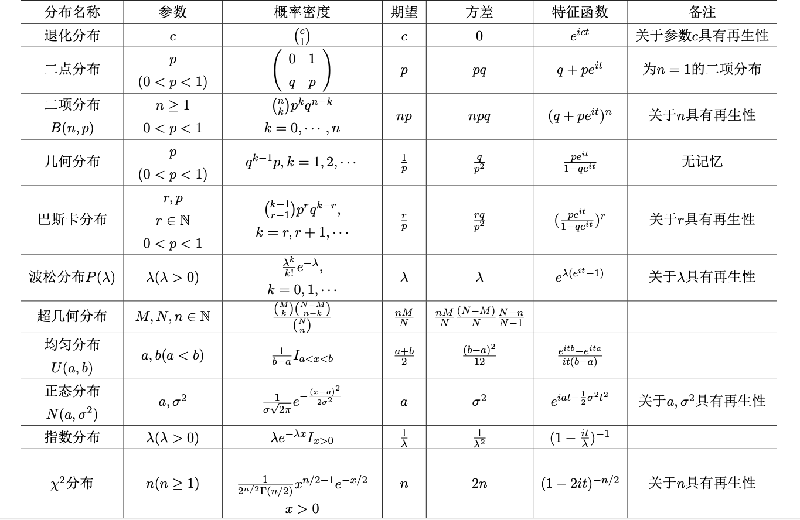

# 概率论与数理统计B

by 鸢一折纸

Vue

统计量的两重性：

是随机变量的函数，所以也是随机变量；同时又可以视为具体的数

计算方差：一定一定要记得减去$(EX)^2$！！！那个$\int x^2f(x)dx$只是$EX^2$！！！

## 一、样本空间和概率

- 容斥定理
- 古典概型和几何概型
	- 事件A中基本事件的个数 $\mid A\mid$ 或者 $\#A$
	- 排列组合，这个比较看经验，真的没什么好办法
	- PPT上总结出来的几个规律：（多项分布）
		- 多组组合模式：有n个不同元素，要把它们分成k个不同的组，使得各组依次有 $n_1,n_2,\cdots,n_k$ 个元素其中 $n_1+\cdots+n_k=n$，则一共有 $\frac{n!}{n_1!\,\cdot\,n_2!\,\cdot\,\dots\,\cdot\,n_k!}$ 种不同的分法
		- 不尽相异元素的排列模式：有n个元素，分属k个不同的类，同类元素之间不可辨认，各类元素分别有 $n_1,n_2,\cdots,n_k$ 个，其中 $n_1+\cdots+n_k=n$，要把它们排成一列，则一共有 $\frac{n!}{n_1!\,\cdot\,n_2!\,\cdot\,\dots\,\cdot\,n_k!}$ 种不同的分法
	- 一个很经典的问题模型：r个球任意放入编号为1～n的n个盒子，每个球放入各个盒子都均可能
		- 球无差别和有差别，样本空间 (即机会均等原则) 是不一样的
		- 若把球解释为粒子，把盒子解释为相空间中的小区域，则这个问题便相应于统计物理学里的 Maxwell—Boltzmann 统计
- 重要：条件概率和独立性
	- 定义不说了
	- 乘法定理：$P(A\mid B)P(B)=P(AB)$
	- 全概率公式：找一组分割 $B_1,\cdots,B_n$，$P(A)=\sum_iP(A|B_i)P(B_i)$
	- Bayes公式：在因果关系互换时需要使用贝叶斯公式：$P(A_k|B)=\frac{P(A_k)P(B|A_k)}{\sum_{j=1}^nP(A_j)P(B|A_j)}$
		- 关于Bayes公式：RHS的分母是P(B) (由全概率公式可知)，然后把它乘到左边，等式两边就都是 $P(A_kB)$ 了(乘法定理)
	- Bayes公式对于很多问题很有借鉴意义
	- 独立性：P(AB) = P(A)P(B)
		- 相互独立和两两独立：相互独立必定两两独立
		- 后面会用到：若随机变量 X 和 Y 相互独立，那么 $f(X)$ 和 $g(Y)$ 也相互独立
	- 小概率原理：很小概率的事件在多次重复试验中几乎是必然发生的
- 求概率的一些方法
	1. 选择合适的样本空间（同色球之间是否无差别、将所有样本全部排出来还是只到要求探测的）讲义例 1.8.1
	2. 递推法（条件化）

## 二、随机变量及其分布

### 2.1 引言 & 2.2 随机变量的分布函数

- 随机变量：值随机会而定的变量
	- 随机变量是把随机试验的结果，也就是样本空间，与一组实数联系起来
- 可列重贝努利实验：在n重Bernulli实验中，当 $n\to\infty$ 时，称为可列重贝努利实验
- 二项分布：略
- 几何分布：以X表示可列重贝努利实验中，第一次出现实验结果A时的试验次数，结果A发生的概率为p，则 $X\sim G(p),\ P(X=k)=(1-p)^{k-1}p$
	- 几何分布具有无记忆性：$P(\xi>m+n\mid\xi>m)=P(\xi>n)$
	- 几何分布是唯一具有无记忆性的取值集合为正整数集的离散型分布
- 负二项分布 (Pascal分布)：以 $X_r$ 表示第r次成功发生时的试验次数，则

$$
P(X_r=k)=C_{k-1}^{r-1}p^r(1-p)^{k-r}\tag{2.2.3.1}
$$

(几何分布是Pascal分布的r=1时的特例)

几何分布提供了一个思考问题的方式，如讲义例2.3.4 **Banach火柴问题**：某人口袋里有两盒火柴，每盒有n根，每次随机取出一盒，从里面取出一根火柴，求当他取出一盒并发现已空时，另一盒里面有r根的概率

部分思路：设取出甲盒为“成功”，则问题转化为“第n+1次成功的时候，试验次数为2n-r+1的概率”

- Poisson分布：$P(X=k)=\frac{\lambda^k}{k!}e^{-\lambda},\ X\sim Poi(\lambda)$
	- 泊松分布没有无记忆性
	- Poisson分布的概率可加性：设 $X\sim Poi(\lambda),\ Y\sim Poi(\mu)$，则有 $X+Y\sim Poi(\lambda+\mu)$
	  - 【From Wikipedia】**Sums of Poisson-distributed random variables**
	  - If $X_i\sim Pois(\lambda_i)$ for $i=1,\cdots,n$ are [independent](https://en.wikipedia.org/wiki/Statistical_independence), then ${\displaystyle \sum _{i=1}^{n}X_{i}\sim \operatorname {Pois} \left(\sum _{i=1}^{n}\lambda _{i}\right)}$. A converse is [Raikov's theorem](https://en.wikipedia.org/wiki/Raikov's_theorem), which says that if the sum of two independent random variables is Poisson-distributed, then so are each of those two independent random variables.
	  - 即，对于n个相互独立的随机变量，各自服从泊松分布与其和服从泊松分布可以互推
	- Poisson定理：设有一列二项分布 $B(n,p_n)$，其中的参数满足条件 $\displaystyle{\lim_{n\to\infty}}np_n=\lambda>0$，则对任何非负整数k都有 $\displaystyle\lim_{n\to\infty}b(k;n,p_n)=\lim_{n\to\infty}C_n^k{p_n}^k(1-p_n)^{n-k}=e^{-\lambda}\frac{\lambda^k}{k!}$
- 离散的均匀分布
- $x_n\downarrow x_0$ 右极限

### 2.3 连续型随机变量

- 概率密度函数、(累积) 分布函数
- 正态分布 (Gauss Distribution)：记住密度函数公式 $f(x)=\dfrac1{\sqrt{2\pi}\sigma}\exp\left\{-\dfrac{(x-\mu)^2}{2\sigma^2}\right\}$
- 指数分布：无记忆性，唯一的无记忆性连续型分布
- 均匀分布

### 2.4 多维随机变量

- 多项分布： $P(X_1=k_1,\cdots,X_n=k_n)=\frac{N!}{k_1!\cdots k_n!}p_1^{k_1}\cdots p_n^{k_n}$，记为 $X=(X_1,\cdots,X_n)\sim M(N;k_1,\cdots,k_n)$

- 二维正态分布 $N(\mu_1,\mu_2,{\sigma_1}^2,{\sigma_2}^2,\rho)$

- 联合分布：联合概率密度函数、联合分布函数

- 边缘分布：
	- 列联表
	- 边缘分布律 (以二维分布为例)：$p_Y(y_j)=P(Y=y_j)=\displaystyle\sum_i^np_{ij}=p_{\cdot j},\ j=1,2,\cdots,m.$
	- 编辑分布律不能决定联合分布律，边际概率密度不能决定联合概率密度
	
- 联合密度求边缘密度：积分积掉不边缘的变量，注意积分区间可能会和其他变量有关，即
	$$
	\int_{I_{x_i}(x_{k_1},\cdots,x_{k_m})}f(x_1,\cdots,x_n)\,dx_i
	$$

### 2.5 条件分布和随机变量的独立性

- 条件分布律：$P(Y=y_j\mid X=x_i)=\dfrac{P(X=x_i,Y=y_j)}{P(X=X_i)}=\dfrac{p_{ij}}{p_{i\cdot}}$
- 连续情形：$f(x|a<Y<b)=\dfrac{\int_a^bf(x,y)\,dy}{\int_a^bf_Y(y)\,dy},\ f_{X\vert Y}(x|y)=\dfrac{f(x,y)}{f_Y(y)}$

#### 例 2.5.3 (讲义)

设$X$和$Y$服从单位圆上的均匀分布，试求$f_{X\vert Y}(x|y)$

$sol.$ 由题设可知 $(X,Y)$ 的联合概率密度函数为
$$
\begin{cases}
\frac{1}{\pi}\quad&if\ x^2+y^2\le1\\
0&else
\end{cases}
$$
易知
$$
f_Y(y)=\begin{cases}
\frac{2}{\pi}\sqrt{1-y^2}\quad&{-1<y<1}\\
0&else
\end{cases}
$$
所以
$$
f_{X|Y}(x|y)=\begin{cases}
\frac{1}{2\sqrt{1-y^2}}\quad&\mid\sqrt{1-y^2}\mid\leq x\\
0&otherwise
\end{cases}
$$

- 随机变量的独立性
	- 条件分布等于无条件分布的情况，即称是独立的
	- 离散型随机变量$X_1,\cdots,X_n$相互独立，当且仅当他们的联合分布律等于各自的边缘分布律的乘积，即 $P(X_1=x_1,\cdots,X_n=x_n)=P(X_1=x_1)\cdots P(X_n=x_n),\quad \forall(x_1,\cdots,x_n)\in\R^n$
	- 连续性随机变量$X_1,\cdots,X_n$相互独立，当且仅当他们的联合密度等于各自的边界密度的乘积，即$f(x_1,\cdots,x_n)=f_1(x_1)\cdots f_n(x_n),\quad \forall(x_1,\cdots,x_n)\in\R^n$
	- 连续性随机变量$X_1,\cdots,X_n$相互独立，当且仅当他们的联合分布函数等于各自的边缘分布函数的乘积，即$F(x_1,\cdots,x_n)=F_1(x_1)\cdots F_n(x_n),\quad \forall(x_1,\cdots,x_n)\in\R^n$
	- 如果随机变量$X_1, · · · , X_n$相互独立，则容易证明其中任何一部分随机变量也相互独立. 然而一般来说, 仅由某一部分独立却无法推出$X_1, · · · , X_n$相互独立
	- 不是很常见的结论，但是可能会用到：设有n个事件：$A_1, · · · , A_n$，对于每个事件$A_i$，定义：$X_i=I_{A_i}$ ($A_i$的示性函数，即事件发生与否与0-1两值的对应关系)，$i=1,2,\cdots,n$，则可证明：$A_1,\cdots,A_n$ 独立 $\Leftrightarrow X_1,\cdots,X_n$ 独立

### 2.6 随机变量函数的概率分布

- 离散的emm画表就OK了
- 离散卷积公式：当 $\xi,\eta$ 是相互独立的非负整值随机变量，各有分布律 $\{a_k\},\,\{b_k\}$. 那么 $\eta+\xi$ 有分布律 $P(\xi+\eta=n)=\displaystyle{\sum_{k=0}^n}a_kb_{n-k}$
- 重要：二项分布、泊松分布的再生性：设 $X\sim B(n,p),\ Y\sim B(m,p)$ 且X和Y相互独立，则 

$$
X+Y\sim B(n+m,p)\tag{2.5.3.1}
$$

- 泊松分布的看前面
	- 应用之一：若 $B_1,\cdots,B_n\ i.\!i.\!d.\sim Ber(p)$，则有 $\displaystyle\sum_{i=1}^nX_i\sim B(n,p)$，就是二项分布拆成贝努利分布

- 密度变换公式：设随机变量$X$有密度函数$f(x),x\in(a,b)\ (a,b可以为\infty)$，而$y=g(x)$在$x\in(a,b)$上是严格单调的连续函数，存在唯一的反函数$x=h(y),\,y\in(\alpha,\beta)$并且$h'(y)$存在并连续，那么$Y=g(x)$也是连续型随机变量并有概率密度函数

$$
p(y)=f(h(y))\vert h'(y)\vert,\quad y\in(\alpha,\beta)
$$

- 当 $g$ 不是连续函数而是分段函数时，密度变换公式变为以下形式：设随机变量 $\xi$ 的密度函数为 $p_\xi(x),\ a<x<b.$ 如果可以把 $(a,b)$ 分割为 (有限个或可列个) 互不重叠的子区间的和 $(a,b)=\bigcup_jI_j$，使得函数 $u=g(t),\,t\in(a,b)$ 在每一个子区间上有唯一的反函数 $h_j(u)$，并且 $h'_j(u)$ 存在并连续，则 $\eta=g(\xi)$ 是连续型随机变量，其密度函数为

$$
p_\eta(x)=\sum_jp_\xi(h_j(x))\,\vert h'_j(x)|
$$

- 多元随机变量用Jaccobi行列式
- 设 $X,Y$ 的联合密度为 $f(x,y)$，则 $X+Y$ 的概率密度$p(z)$为

$$
p(z)=\displaystyle\int_{-\infty}^{+\infty}f(x,z-x)dx=\displaystyle\int_{-\infty}^{+\infty}f(z-y,y)dy
$$

- 卡方分布：
	- 卡方分布具有再生性（定义见前面）
	- 若 $X\sim\chi_n^2$，则EX=n，VarX=2n
- 正态分布也有再生性性质
- 总结一下再生性 (即对于随机变量的和，参数的叠加性质)：
	- 二项分布（关于试验次数有再生性）
	- Poisson分布（关于$\lambda$）
	- Pascal分布（关于成功次数r）
	- 正态分布（两个参数都有再生性）
	- $\chi^2$ 和 $\Gamma$ 也有再生性（$\chi^2_n$ 的n）
- 随机变量商的概率密度
	- 如果 $(\xi,\eta)$ 是二维连续型随机向量，他们的联合密度为 $f(x,y)$，则他们的商 $\xi/\eta$ 是连续型随机变量，具有密度函数（写成 $f_{X/Y}$ 更好理解吧）

$$
p_{\xi/\eta}(z)=\int_{-\infty}^{+\infty}|t|\,f(zt,t)\,dt,\quad\forall z\in\R\\
p_{\eta/\xi}(z)=\int_{-\infty}^{+\infty}|u|\,f(u,zu)\,du,\quad\forall z\in\R
$$

- 重要：三大分布
	- 见第五章的最后面

### 2.7 极小值和极大值的分布

- 对于n个相互独立的随机变量 $X_1,\cdots,X_n$，考察他们的最大值和最小值 $X_{(n)}=\max\{X_1,\cdots,X_n\}$，$X_{(1)}=\min\{X_1,\cdots,X_n\}$，并利用这n个随机变量的分布函数 $F_1(x),\cdots,F_n(x)$，有

$$
F_{X_{(n)}}(x)=\prod_{k=1}^nF_k(x)\\
F_{X_{(1)}}(x)=1-\prod_{k=1}^n(1-F_k(x))
$$

- 若这些随机变量并不相互独立，则利用其联合概率密度函数计算
- 特殊的一些服从独立同分布的随机变量
	- n个贝努利分布的和为二项分布 $B(n,p)$
	- 有限个成功概率相同的二项分布之和还是二项分布
	- 有限个独立的 Poisson 分布之和服从 Poisson 分布，参数相加
	- r个独立同分布几何分布 G(p) 的随机变量之和服从参数为r和p的Pascal分布
	- 正态分布还是正态分布
		- 若 $X\sim N(\mu,\sigma^2)$，则 $aX+b\sim N(a\mu+b,a^2\sigma^2)$
		- 若 $X\sim N(\mu_1,{\sigma_1}^2),\ Y\sim N(\mu_2,{\sigma_2}^2)$，则 $X+Y\sim N(\mu_1+\mu_2,{\sigma_1}^2+{\sigma_2}^2)$

## 三、随机变量的数字特征

### 3.1 数学期望和中位数

- 离散的不说了，连续的 $EX=\int_{-\infty}^{+\infty}xf(x)\,dx$
- 容易遗漏的：期望不存在的，比如Cauchy分布 $p(x)=\frac{1}{\pi(1+x^2)},\quad x\in\R$
- 如果$\xi$和$\eta$是定义在同一个概率空间上相互独立的（至少不相关的）随机变量，他们的数学期望都存在，那么他们乘积$\xi\eta$的数学期望也存在，并且有 $E\xi\eta=E\xi E\eta$
- 若 $\xi>\eta$，则有 $E\xi>E\eta$
- 条件期望：设X在Y=y的条件下的条件分布为 F(x|Y=y)，则期望存在时，$E(X|Y=y)=\int_{-\infty}^{+\infty}x\,dF(x|Y=y)$
	- 期望所具有的性质条件期望同样满足
- 随机变量函数的期望：设随机变量为离散型，有分布$P(X=a_i)=p_i$，或者为连续型有概率密度函数$f(x)$，

$$
Eg(x)=\begin{cases}
\displaystyle\sum_ig(a_i)p_i,\quad\quad&\displaystyle\sum_i|g(a_i)|p_i<\infty\\
\displaystyle\int_{-\infty}^{+\infty}g(x)f(x)\,dx&\displaystyle\int_{-\infty}^{+\infty}|g(x)|f(x)\,dx<\infty
\end{cases}
$$

- 全期望公式：$Eg(X)=E\{E[g(X)|Y]\}$，$E(g(X)|Y)$ 是随机变量 Y 的函数
- 中位数和p分位数：小于这个数的概率是p

### 3.2 方差、协方差和矩

- 容易遗漏：r阶原点矩和中心矩 (当随机变量$\xi$r次可积时)
	- $\alpha_r=E\xi^r=\displaystyle\int_{-\infty}^{+\infty}x^r\,dF_\xi(x)$称为$\xi$的r阶原点矩
	- $\mu_r=E|\xi-E\xi|^r=\displaystyle\int_{-\infty}^{+\infty}|x-E\xi|^r\,dF_\xi(x)$ 称为$\xi$的r阶中心矩
	
- 随机变量的方差 (表示为 $\color{coral}{D(X)}$ 或 $Var(X)$)：$Var(X)=E(X^2)-(EX)^2$
	- $\forall c,\quad Var(X)\le E(X-c)^2$，当且仅当 c=EX 时取等号
	- $Var(aX+bY)=a^2Var(X)+b^2Var(Y)$，当X和Y相互独立时
	
- 标准化随机变量$X^*=\frac{X-EX}{\sqrt{Var(X)}}$

- 协方差
	- $Var(X+Y)=Var(X)+Var(Y)+2E(X-EX)(Y-EY)$
	- 若随机变量X和Y平方可积，那么称X和Y的协方差为 $Cov(X,Y)=E(X-EX)(Y-EY)$
		- 关于平方可积：
			- 平方可积的随机变量，可以简单地理解它的方差存在且有限，在很多实际问题里很重要
			- 不过，积分是对于连续函数而言的
			- 其实本质上是一样的，可以统一到微积分的定义中。可以这么理解，概率论里面提到的某个随机变量是平方可积，准确来说是二阶矩存在，即这个随机变量的平方关于它的分布函数的积分＜∞。在这里面，如果是离散的随机变量，就是求和了
	- 由 Cauchy-Schwarz不等式可得：$Cov(\xi,\eta)\le\sqrt{D\xi}\,\cdot\sqrt{D\eta}$，且等号成立，当且仅当 $\exists\,\tau_0\in{\cal{R}},\ s.\!t.\,P(\xi=\tau_0\eta)=1$，后者等价于 $\xi$ 和 $\eta$ 这两个随机变量线性相关，即恒满足 $\xi=t_0\eta$ 
	
- 协方差矩阵 $\displaystyle\sum$：
	$$
	for\ r.v.\ \xi_1,\cdots,\xi_n\\
	\begin{align}\\
	\sum=&(Cov(\xi_i,\xi_j))\\
	=&\begin{pmatrix}
	D(\xi_1) & Cov(\xi_1,\xi_2) & \cdots & Cov(\xi_1,\xi_n)\\
	Cov(\xi_2,\xi_1) & D(\xi_2) & \cdots & Cov(\xi_2,\xi_n)\\
	\vdots & \vdots & \ddots & \vdots \\
	Cov(\xi_n,\xi_1) & Cov(\xi_n,\xi_2) & \cdots & D(\xi_n)
	\end{pmatrix}
	\end{align}
	$$
	
- 协方差的叠加性质：

$$
\begin{align}

&Cov\left(\sum_{i=1}^{n}a_iX_i,\,\sum_{j=1}^nb_jY_j\right)\\
=\ &
\begin{pmatrix}
a_1 & a_2 & \cdots & a_n
\end{pmatrix}
\begin{pmatrix}
Cov(X_1,Y_1) & Cov(X_1,Y_2) & \cdots & Cov(X_1,Y_n)\\
Cov(X_2,Y_1) & Cov(X_2,Y_2) & \cdots & Cov(X_2,Y_n)\\
\vdots & \vdots & \ddots & \vdots \\
Cov(X_n,Y_1) & Cov(X_n,Y_2) & \cdots & Cov(X_n,Y_n)
\end{pmatrix}
\begin{pmatrix}
b_1 \\ b_2 \\ \vdots \\ b_n
\end{pmatrix}\\
=\ &
\sum_{i=1}^n\sum_{j=1}^na_ib_jCov(X_i,Y_j)

\end{align}
$$

- 相关系数：设X，Y为随机变量，称 $\rho_{X,Y}=\frac{Cov(X,Y)}{\sqrt{VarX}\,\cdot\,\sqrt{VarY}}$ 为X和Y的相关系数 (“保准尺度下的协方差”)，当它为0的时候X和Y (应该叫) 不相关 (而不是) 独立
	- 独立是比不相关更强的性质，不相关不一定独立，但是独立一定不相关
	- $|\rho_{X,Y}\vert\le1$，等号当且仅当X和Y线性相关时取到，即 $Y=aX+b$，当 $a>0$ (正相关) 时 $\rho$ 取1
	- 注意：即便X和Y之间有着严格的函数关系，Cov(X,Y) 依然可以为0，如下例

#### 例 3.2 (书)

设 $X\sim U(-1/2,1/2)$，而 $Y=\cos X$.

则Y和X有严格的函数关系，但由于EX=0，故有 ${\mathrm{Cov}}(X,Y)=E(XY)=E(X\cos X)=0$

- 对于任何非退化 (单点分布) 的平方可积的随机变量 $\xi,\eta$，如下四个命题相互等价
	- $\xi$ 和 $\eta$ 不相关
	- $Cov(\xi,\eta)=0$
	- $E\eta\xi=E\eta\,E\xi$
	- $Var(\xi+\eta)=Var(\xi)+Var(\eta)$
- 对于非退化的平方可积的随机变量 X，Y，如果X和Y相互独立，那么他们一定不相关，反之未必成立，原因如 $(X,Y)$ 服从单位圆内的均匀分布
	- 特殊：只有在正态情形下，不相关和独立等价

盗一张图：

## 四、大数率和中心极限定理

### 4.1 大数律

- 如果对于任何 $\varepsilon>0$，都有 $${{\lim}\atop{n\to \infty}}P(|\xi_n-\xi|≥\varepsilon)=0$$ 那么我们称随机变量序列 ${\epsilon_n,\ n\in \Bbb{N}}$ 依概率收敛到随机变量 $\xi$ ，记为 $\xi_n\,{\stackrel{p}{\to}}\,\xi$
- 弱大数律：设 $X_1,\cdots,X_n$ 是独立同分布的一列随机变量，有公共期望 $\mu$ 和公共方差 $\sigma^2$，则有 $\displaystyle\lim_{n\to\infty}P(\mid{\overline X_n}-\mu\mid\ge\varepsilon)=0,\ \forall\varepsilon>0$，或者说 $\displaystyle\overline{X}=\frac{1}{n}\sum_{k=1}^nX_k\stackrel{p}{\to}\mu$
- Markov不等式：若Y为只取非负值的随机变量，则对于任给常数 $\varepsilon>0$，有 $P(Y\ge\varepsilon)\le EY/\varepsilon$
- Chebyshev不等式：若VarY存在，则 $P(|Y-EY|\ge\varepsilon)\le VarY/\varepsilon^2$

### 4.2 中心极限定理

- 中心极限定理是是概率论中讨论随机变量序列的分布收敛于正态分布的一类定理
- 设 $\{X_n\}$ 为 $i.i.d.$ 的随机变量序列，具有公共的数学期望 $\mu$ 和方差 $\sigma^2$，则 $X_1+\cdots+X_n$ 的标准化形式 $\frac{1}{\sqrt{n}\sigma}(X_1+\cdots+X_n-n\mu)$ 满足中心极限定理，即对 $\forall x\in\R,\,\displaystyle\lim_{n\to\infty}F_n(x)=\Phi(x)$，其中 $F_n(x)$ 为 $\frac{1}{\sqrt{n}\sigma}(X_1+\cdots+X_n-n\mu)$ 的分布函数，记为 $\displaystyle\frac{1}{\sqrt{n}\sigma}(X_1+\cdots+X_n-n\mu)\stackrel{d}{\to}N(0,1)$

## 五、数理统计的基本概念

### 统计量

> 由样本算出的量是统计量, 或曰,统计量是样本的函数

1. 统计量只与样本有关，不能含未知参数
2. 由于样本具有两重性, 即样本既可以看成具体的数, 又可以看成随机变量; 统计量是样本的函数, 因此统计量也具有两重性

#### 常用的统计量

- 样本均值
	- $\bar{X}=\frac{1}{n}\sum_{i=1}^nX_i$
- 样本方差：系数是 (1/n-1) ！！！
	- $S^2=\frac{1}{n-1}\sum_{i=1}^n(X_i-\bar{X})^2$
- 样本矩
	- 样本的 k 阶原点矩
		- $a_k=\frac{1}{n}\sum_{i=1}^{n}{X_i}^k,\quad k=1,2,\cdots$
		- 特别地，当 k = 1 时，$a_1=\bar{X}$ 即为样本均值
	- 样本的 k 阶中心矩
		- $m_k=\frac{1}{n}\sum_{i=1}^{n}(X_i-\bar{X})^k,\quad k=2,3,\cdots$
		- k 是从 2 开始的，因为一阶的是0…
- 次序统计量及其有关统计量
	- 次序统计量：设 X1, · · · , Xn 为从总体 F 中抽取的样本, 把其按大小排列为 $X_{(1)} \le X_{(2)} \le\cdots\le X_{(n)}$，则 $(X_{(1)} , X_{(2)} ,\cdots, X_{(n)})$ 及其任一部分都称为次序统计量
	- 样本中位数
	- 极值：$X_{(n)}$ 和 $X_{(1)}$ 分别为极大值和极小值
- 经验分布函数：$F_n(x)=\{X_1,\cdots,X_n$中$\le x$的个数$\}/n$

#### 正态总体样本均值和样本方差的分布

- 正态变量线性函数的分布
	- 设随机变量 $X_1, · · · , X_n\ i.i.d. ∼ N(a, σ^2),\quad c_1, c_2, · · · , c_n$为常数，则有
	- $T=\sum_{i=1}^{n}c_kX_k ∼ N(a\sum_{k=1}^nc_k,\sigma^2\sum_{k=1}^nc_k^2)$
	- 特别地，当所有系数均为 1/n 时，服从 $N(a,\sigma^2/n)$
- 样本均值和样本方差
	- 设随机变量 $X_1, · · · , X_n\ i.i.d. ∼ N(a, σ^2)$
	- 样本均值 $\bar{X} ∼ N(a,\sigma^2/n)$
	- 样本方差满足 $(n-1)S^2/\sigma^2 ∼ \chi^2_{n-1}$
	- 重要：$\bar{X}$ 和 $S^2$ 独立（只对于正态总体而言成立）

#### 几个重要推论

- 设随机变量 $X_1, · · · , X_n\ i.i.d.\sim N(a, σ^2)$
	
	- $T=\frac{\sqrt{n}(\bar{X}-a)}{S} ∼ t_{n-1}$
	
- 设随机变量 $X_1,\cdots, X_n\ i.i.d.\sim N(0,1)$

	- 则 $Y=X_1^2+\cdots+X_n^2\sim{\chi_n}^2$

- 设 $X_1,\cdots, X_m\ i.\!i.\!d.\sim N(\mu_1,\sigma_1^2),\ Y_1,\cdots, Y_n\ i.\!i.\!d.\sim N(\mu_2,\sigma_2^2)$，且假定 $\sigma_1^2=\sigma_2^2=\sigma^2$，样本 $X_1,\cdots,X_m$ 与 $Y_1,\cdots,Y_n$ 独立，则

	- $$
		T=\frac{(\bar X-\bar Y)-(\mu_1-\mu_2)}{S_\omega}\cdot\sqrt{\frac{mn}{m+n}}\sim t_{n+m-2}
		$$

	- 这里 $(n+m-2)S_\omega^2=(m-1)S_1^2+(n-1)S_2^2$，S为样本方差如前定义

- 设 $X_1,\cdots, X_m\ i.\!i.\!d.\sim N(\mu_1,\sigma_1^2),\ Y_1,\cdots, Y_n\ i.\!i.\!d.\sim N(\mu_2,\sigma_2^2)$，且样本 $X_1,\cdots,X_m$ 与 $Y_1,\cdots,Y_n$ 独立，则

	- $$
		F=\frac{S_1^2}{S_2^2}\cdot\frac{\sigma_2^2}{\sigma_1^2}\sim F_{m-1,n-1}
		$$

- 没用过：设随机变量 $X_1, · · · , X_n\ i.i.d.\sim Exp(\lambda),\ I_{[x>0]}$，则

	- $$
		2\lambda n\bar X=2\lambda\sum_{i=1}^nX_i\sim{\chi_{2n}}^2
		$$

### 数理统计的统计推断问题总结

获得有效数据后, 统计推断问题可以按照如下的步骤进行：

1. 确定用于统计推断的合适统计量；
2. 寻求统计量的精确分布；在统计量的精确分布难以求出的情形，可考虑利用中心极限定理或其它极限定理找出统计量的极限分布.
3. 基于该统计量的精确分布或极限分布，求出统计推断问题的精确解或近似解.
4. 根据统计推断结果对问题作出解释.

**其中第二步是最重要, 但也是最困难的一步. 正态总体下样本均值和样本方差的分布, 在寻求与正态变量有关的统计量精确分布时, 起着十分重要的作用**

### 三大分布

括号里面的 $\alpha$ 就是显著性水平，代表犯错误的概率。然后下面的图里面三个都是分位数

$\chi_n^2(\alpha),\ t_n(\alpha),\ F_{m,n}(\alpha)$

#### $\chi^2$ 分布

设随机变量 $X_1,\cdots, X_n\ i.i.d.\sim N(0,1)$，令 $Y=X_1^2+\cdots+X_n^2$，则称 X 是自由度为 n 的 χ2 变量, 其分布称为自由度为 n 的χ2分布, 记为 $X\sim {χ_n}^2$

1. 若 $X\sim{\chi_n}^2$ 有 $EX=n,\ VarX=2n$
2. (再生性) 若相互独立的随机变量 $Z_1,Z_2$ 满足 $Z_1\sim\chi_{n_1}^2,Z_2\sim\chi_{n_2}^2$，则有 $Z_1+Z_2\sim\chi_{n_1+n_2}^2$

#### $t$ 分布

设随机变量 $X\sim N(0,1),Y\sim\chi_n^2$，且X和Y独立，则称 $T=\dfrac{X}{\sqrt{Y/n}}$ 为自由度为 n 的 t 变量，其分布称为自由度为 n 的t分布，记为 $T\sim t_n$

1. 若 $T\sim t_n$ 则有当n≥2时，$ET=0$；当n≥3时，$VarT=\frac{n}{n-2}$
2. 当 $n\to\infty$ 时，t变量的极限分布为标准正态分布

#### $F$ 分布

设随机变量 $X\sim χ^2_m, Y\sim χ^2_n$，且 X 和 Y 独立,则称 $F =\frac {X/m} {Y /n}$ 为自由度分别是 m 和 n 的 F 变量, 其分布称为自由度分别是m和n的F 分布,记为 $F\sim F_{m,n}$

1. 若 $Z\sim F_{m,n}$，则 $1/Z\sim F_{n,m}$
2. 若 $T\sim t_n$，则 $T^2\sim F_{1,n}$
3. $F_{m,n}(1-\alpha)=1/F_{n,m}(\alpha)$

### 正态总体样本均值和样本方差的分布

#### 正态变量线性函数的分布

$r.v.\ X_1,\cdots,X_n\,i.i.d.\sim N(\mu,\sigma^2),\ c_1,\cdots,c_n$ 为常数，则有
$$
T=\sum_{i=1}^n c_iX_i\sim N(\mu\sum_{k=1}^nc_k,\ \sigma^2\sum_{k=1}^n{c_k}^2)
$$

#### 正态变量样本均值和样本方差的分布

$$
\begin{gather}
\overline{X}\sim N(\mu,\ \sigma^2/n)\\
\frac{(n-1)S^2}{\sigma^2}\sim\chi^2_{n-1}
\end{gather}
$$

 且 $\overline X$ 和 S^2^ 独立

## 六、参数估计

- 点估计: 用样本的一个函数 T(X1,...,Xn) 去估计 g(θ)
- 区间估计: 用一个区间 (区域) 去估计 g(θ)

### 6.1 点估计

#### 6.1.1 矩估计 (ME)

- 矩方法是基于一种简单的 “替换” 思想建立起来的一种估计方法。其基本思想是用样本矩估计总体矩。由大数律，如果未知参数和总体的某个 (些) 矩有关系，我们很自然的来构造未知参数的估计
- 样本矩 $a_m=\displaystyle\frac1n\sum_{i=1}^n{X_i}^m$，总体矩 $\alpha_m=\displaystyle\int_{-\infty}^{+\infty}x^mf(x;\theta_1,\cdots,\theta_k)\,dx=EX^m$ (由P110随机变量函数的期望公式 $E(g(x))=\displaystyle\int_{-\infty}^{+\infty}g(x)f(x)\,dx$ 可知)
- 一阶矩的时候总体矩就是期望，不用再套那个积分/求和了
- 矩估计方法应用的原则是：能用低阶矩处理的就不用高阶矩

#### 6.1.2 极大似然估计 (MLE)

- 设总体有分布 $f(x;\theta_1,\cdots,\theta_k)$，$X_1,\cdots,X_n$ 是从总体中抽样出来的样本，则 $L(x_1,\cdots,x_n;\theta_1,\cdots,\theta_k)=\displaystyle\prod_{i=1}^nf(x_i;\theta_1,\cdots,\theta_k)$
- 用一组满足条件 $L(X_1,\cdots,X_n;{\theta_1}^*,\cdots,{\theta_k}^*)=\displaystyle\max_{\theta_1,\cdots,\theta_k}f(x_i;\theta_1,\cdots,\theta_k)L(X_1,\cdots,X_n;\theta_1,\cdots,\theta_k)$ 的参数来作为估计值
- 常用取对数的方式
- 如果 f 对各参数存在连续的偏导数的时候可以列出偏微分方程组，否则只能利用上面的定义式
- 称 $\hat{θ}$ 为参数 θ 的最大似然估计值, 而 $\hat{\theta}(X)$ 称为参数 θ 的极大似然估计量
- 正态分布的极大似然估计 $\hat{\sigma^2}=m_2$，不分 $\mu$ 是不是已知，与区间估计不同

| Distributions               | Maximum likelihood estimation            |
| --------------------------- | ---------------------------------------- |
| Poisson: $Poi(\lambda)$     | $\hat{\lambda}=\bar{\rm{X}}$             |
| Normal: $N(\mu,\sigma^2)$   | $\hat{\mu}=\bar{X},\,\hat{\sigma^2}=m_2$ |
| Exponential: $Exp(\lambda)$ | $\hat{\lambda}=1/\bar{X}$                |
| Uniform: U(0,$\theta$)      | $\hat{\theta}=\max(X_i)$                 |
| Binomial: B(n,p)            | $\hat p=\bar X/N$                        |

#### 6.1.3 点估计的优良准则

##### 相合性 (书 4.3.3)

设总体分布依赖于参数 $\theta_1,\cdots,\theta_k$，$g(θ_1,··· ,θ_k)$ 是待估参数函数。设 X1,··· ,Xn 为自该总体中抽取的样本，T(X1,··· ,Xn) 为 g(θ1,··· ,θk) 的一个估计量，如果对任意的 ε > 0 和 θ1,··· ,θk 的一切可能值都有
$$
\lim_{n\to\infty}P_{\theta_1,\cdots,\theta_k}(\vert T(X_1,\cdots,X_n)-g(\theta_1,\cdots,\theta_k)\vert\ge\varepsilon)=0
$$
我们则称 T(X1,··· ,Xn) 为 g(θ1,··· ,θk) 的一个 (弱)相合估计量

##### 无偏性 (书 4.3.1)

- 若 $E_{\theta_1,\cdots,\theta_k}[\hat{g}(X_1,\cdots,X_n)]=g(\theta_1,\cdots,\theta_k)$，则称 $\hat{g}$ 是 $g(\theta_1,\cdots,\theta_k)$ 的一组无偏估计量
- $\hat{g}$ 是参数的函数 $g(\theta)$ 的估计，如果要判断这个估计量 $\hat{g}$ 是否是 $g(\theta)$ 的无偏估计，就要先求这个估计量的期望，看这个期望是不是正好是 $g(\theta)$，如果是，就说明 $\hat{g}$ 就是参数函数 $g(\theta)$ 的无偏估计
- $\hat{g}$ 由样本构成，是作为只由参数构成的 $g$ 的估计。左边求期望，去掉了随机变量 $\rm{X}$ 的随机性，得到一个与X无关的“常数”，这个常数就是等式右边的g，这个g刚说了是只与我们想要估计得参数 $\theta$ 有关，而在概统里面，参数 $\theta$ 被认为是一个没有随机性的未知常数，所以 $g(\theta)$ 也同样是没有随机性的未知“常数”

###### ***关于修改估计参数得到无偏估计：***

1. 由于估计参数是随机变量的函数，故其期望值也具有正常的期望性质
2. 通过线性变换参数得到无偏的参数即可

##### 有效性

设 $\hat g_1(X_1,\cdots ,X_n)$ 和 $\hat g_2(X_1,\dots ,X_n)$ 为待估参数函数 g(θ) 的两个不同的无偏估计量，若对任意的 $\theta\in\Theta$, 有
 $Var(\hat g_1(X_1,\dots ,X_n))\le Var(\hat g_2(X_1,\dots ,X_n))$

而且至少对某个 $\theta_0\in\Theta$ 使得严格不等式成立。则称 $\hat g_1$ 较 $\hat g_2$ 有效

##### 渐进正态性

许多形式很复杂的统计量 (未必是和)，当 n 很大时， 其分布都渐近于正态分布，这个性质称为统计量的 “渐近正态性”

### 6.2 区间估计

#### 6.2.1 置信区间

- 置信系数和置信水平
  - 考虑概率 $P(\ \hat{\theta_1}(X_1,\cdots,X_n)<\theta<\hat{\theta_2}(X_1,\cdots,X_n)\ )$
  - 对于参数落在区间内的概率，若对于参数的任何值，这个概率都等于 $1-\alpha$，就叫 $1-\alpha$ 为置信系数，如果是都不小于 $1-\alpha$，就叫置信水平，不过一般不区分
  - 置信区间就是在给定的置信水平之下，去寻找有优良精度的区间
- 上分位点
	- 满足条件 $F(v_\beta)=1-\beta$ 的点 $v_\beta$ 就是分布函数 $F$ 的上$\beta$分位点
- 求置信区间
	- 找一个与待估参数 $g(\theta)$ 有关的统计量 $T$ ，一般是其一个良好的点估计（很多时候采用MLE）
	- 找出某一函数 $S(T,g(\theta))$，其分布 $F$ 要与 $\theta$ 无关，$S$ 称为**枢轴变量**
		- 这个分布通常是三大分布，或者正态分布，这就是之前讲三大分布的一个重要的用处
	- 标准：对任何常数 $a<b$，不等式 $a\leq S(T,g(\theta))\leq b$ 要能表示成等价的形式 $A\leq g(\theta)\leq B$（其实是解不等式），其中 $A,B$ 只与 $T,a,b$ 有关而与参数 $\theta$ 无关
	- 取分布的上 $\alpha/2$ 分位数 $\omega_{\alpha/2}$ 和上 $(1-\alpha)$ 分位数 $\omega_{1-\alpha/2}$，有 $P(\omega_{1-\alpha/2}\leq S(T,g(\theta))\leq\omega_{\alpha/2})=1-\alpha$
	- 带入 $S(T,g(\theta))$，解不等式组 $\omega_{1-\alpha/2}\leq S(T,g(\theta))\leq\omega_{\alpha/2}$，得到$\theta$的区间
	- 注意：
		- 在选取估计量的过程中，如果有参数是已知的，则**必须不能**用它的估计量，因为估计量是随机变量的函数，有误差是很正常的
		- 选取枢轴变量时参考三大分布相关的一些性质，比如
			- $X\sim N(\mu,\sigma^2)$
				- $\mu$未知，求$\sigma^2$的置信区间：$\frac{(n-1)S^2}{\sigma^2}\sim\chi^2_{n-1}$
				- $\sigma^2$未知，求$\mu$的置信区间：$\frac{\sqrt{n}(\bar{X}-\mu)}{S}\sim t_{n-1}$
				- $\sigma^2$已知，求$\mu$的置信区间：$\bar{X}\sim N(\mu,\frac{1}{n}\sigma^2),\ \therefore\frac{\bar{X}-\mu}{\sqrt{\frac{1}{n}\sigma_0^2}}\sim N(0,1)$
				- $\mu$已知，求$\sigma^2$的置信区间：$\mu$代替$\overline{X}$，作为求$S^2$的估计量，回到第一种情形，$\sim\chi_n^2$

#### 6.2.2 大样本法

由中心极限定理确定近似的枢轴变量 (会服从标准正态分布) (渐进正态性)

## 七、假设检验

假设检验问题是一类通过给定的样本集来对指定参数的取值 (区间) 是否符合预期来进行检验的问题

将参数取值分为对立的两个域：原假设 & 对立假设

拒绝域是对于样本而言的，而不是检验统计量，就是说，对于我随机抽取的一组样本，我应不应该接受原假设

### 7.1 基本概念和问题的提法

#### 7.1.1 基本概念

- (统计) 假设: 在数理统计中, 关于总体分布的概率性质的假定. 例如假设正态总体, 二项总体等, 或者二项总体中成功概率 $p ≤ 0.5$ 等等
- (统计) 检验: 使用样本对所作出的假设进行检查的方法和过程
- 两个假设：原假设 (零假设) $H_0$，备择假设 (对立假设) $H_1$
- 检验统计量$T$：在检验一个假设时所使用的统计量：当 $T\geq C$ (拒绝域之外) 时接受原假设
- 两类错误
	- 称 “实际上 H0 成立但是它被拒绝” 这个错误为第 I 类错误 (弃真)
	- 称 “实际上 H0 不成立但是它没有被拒绝” 这样一类错误为第 II 类错误 (存伪)
	- 在控制 I 类错误的基础上, 尽量少犯第 II 类错误
	- 在只限制第一类错误的原则下的检验方法，就称 为“显著性检验”
	- 两类错误的求法：
		- 第一类错误的拒绝域见下面*将问题一般化*
		- 第二类错误：利用功效函数解释
			- $\beta_{H_1}(\theta \mbox{不在拒绝域})$，即先写出 $P(\theta\notin A)$，再代入检验统计量表达式，以便查表
- 显著性水平 $\alpha$
	- 给定一个允许的犯第一类错误概率的最大值 $α$, 选取 $τ$ 使得 $P_{H_0}(T<\tau)≤\alpha$，参数 $\theta$ 可取 $H_0$ 范围内的任意值
- 将问题一般化
	- 提出假设检验问题
	- 根据参数的估计方法构造一个适当的检验统计量
	- 根据对立假设的形状构造一个检验的拒绝域 W = {T (X1, · · · , Xn) ∈ A}，比如拒绝域可取为$\{T>\tau\}$，称 $\tau$ 为临界值
	- 结合T在H~0~下的分布，定出A

#### 7.1.2 原假设的提法

重要而且容易错

- 原则一: 将受保护的对象置为零假设
- 原则二: 如果你希望 “证明” 某个命题, 就取相反结论或者其中一部分作为零假设 (类似于反证法)
- 原则三: 假设检验的 “拒绝零假设” 结果比 “不能拒绝零假设” 更有保证

#### 7.1.3 检验统计量的选取及假设检验的步骤

检验统计量选取类似于之前置信区间的枢轴变量

假设检验的步骤：

1. 求出未知参数 θ 的一个较优的点估计 $\hat θ = \hat θ(X_1,\dots , X_n)$，如极大似然估计
2. 以 $\hat θ$ 为基础，寻找一个检验统计量 T = t(X1, · · · , Xn)，且使得当 θ = θ~0~ 时，T 的分布已知 (如 N(0, 1), tn, Fm,n)，从而容易通过查表或计算得到这个分布的分位数，用以作为检验的临界值
3. 以检验统计量 T 为基础, 根据对立假设 H1 的实际意义, 寻找适当形状的拒绝域 (它是关于 T 的一个或两个不等式, 其中包含一个或两个临界值)
4. 当零假设成立时, 犯第 I 类错误的概率小于或等于给定的显著性水平 α, 这给出一个关于临界值的方程, 解出临界值, 它 (们) 等于 T 的分位数, 这样即确定了检验的拒绝域
5. 如果给出样本观测值, 则可算出检验统计量的样本观测值，如落在拒绝域中则可拒绝零假设, 否则不能

- 功效函数
	- JianRui Zhang
		- 可以参考那本*statistical computing with R*的6.3.2节
		- 大致就是说：参数 $\theta$ 取值在A0和A1两个集合里面，如果在集合A0里面，就是假设H0是对的；如果在集合A1里面，就是假设H1是对的。然后power（功效函数）是说，$\theta$ 取值是A1里面的某个值 $\theta_1$ 的时候，我们这个检验能判断正确（判断出来H0是错的，H1是对的）的概率。我们希望power越大越好
		- 如果A0和A1分别都只有一个元素，你可以简单地认为power就是1-beta。beta是第二类错误发生的概率
	- 功效函数是用来检验第二类错误发生概率的，是不同 (保证第一类错误在显著性水平内的) 检验之间好坏 (是否容易发生第二类错误) 的判断
	- $\beta_\Phi(\theta_1,\cdots,\theta_k)=P_{\theta_1,\cdots,\theta_k}$(​在检验 $\Phi$ 之下，$H_0$ 被否定)
	- 功效函数和显著性水平的区别：有两种可能，一种是H0对，一种是H1对。$\alpha$ 是在H0实际正确的情况下，检验结果拒绝了H0，选择了H1的概率；功效函数是在H1实际正确的情况下，拒绝了H0，正确选择了H1的概率

### 7.2 一样本和两样本总体参数检验

#### 7.2.1 一样本正态总体参数检验

- Z 检验 (方差已知时对 $\mu$ 的检验)
	- 分布：$N(0,1)$
	- 双侧假设 (联系置信区间)
	  - $H_0:\mu=\mu_0\leftrightarrow H_1:\mu\neq\mu_0$
	  - $\because\mu$ 的极大似然估计为 $\bar{X}$，故取 “标准化” 后的检验统计量 $Z=\sqrt{n}\frac{\bar{X}-\mu_0}{\sigma}$
	  - 有 $P_{H_0}(\mid Z\mid>\tau)<\alpha$，拒绝域 $\{|Z|>u_{\alpha/2}\}$
	- 右侧假设 (联想置信界)
	  - $H_0:\mu=\mu_0\leftrightarrow H_1:\mu>\mu_0$ 或 $H_0:\mu\leq\mu_0\leftrightarrow H_1:\mu>\mu_0$
	  - 检验统计量 同上
	  - 拒绝域 $\{|Z|>u_{\alpha}\}$
	- 左侧假设
	  - $H_0:\mu=\mu_0\leftrightarrow H_1:\mu<\mu_0$ 或 $H_0:\mu\geq\mu_0\leftrightarrow H_1:\mu<\mu_0$
	  - 检验统计量 同上
	  - 拒绝域 $\{\mid Z\mid<-u_\alpha\}$
	- 若还要求：犯第二类错误的概率要小于指定的 $β > 0$
	  - 即等价于：$\begin{gather}\beta_\Phi(\mu)\geq1-\beta\\\mu 在拒绝域\end{gather}$
	  - 分析：第二类错误 = H0不成立但没有被拒绝
	  	- $\beta_\Phi(\mu)$ 是指H0被拒绝，故其概率需要 $\geq1-\beta$
	  	- 而 $\mu<\mu_0$ 就是反映了H0不成立
- $t$ 检验 (方差未知时均值的检验)
	- 检验统计量：$T=\sqrt{n}\dfrac{\bar{X}-\mu_0}{S}$
	- 分布：$t_{n-1}$
	- 拒绝域：
		- 双侧假设：$\{\mid T\mid>t_{n-1}(\alpha/2)\}$
		- 右侧假设：$\{\mid T\mid>t_{n-1}(\alpha)\}$
		- 左侧假设：$\{\mid T\mid<-t_{n-1}(\alpha)\}$
- $\chi^2$ 检验 (方差的检验)
	- 均值已知：
		- 检验统计量：$\displaystyle\chi^2=\frac{n{\hat{\sigma}}^2}{\sigma_0^2}=\frac{(n-1)S^2}{\sigma_0^2}=\frac{1}{\sigma_0^2}\sum_{i=1}^n(X_i-\mu)^2$
		- 分布：$\chi_n^2$
		- 拒绝域：
			- 双侧假设：$\{\chi^2<\chi_n^2(1-\alpha/2)\,或\,\chi^2>\chi_n^2(\alpha/2)\}$
			- 右侧假设：$\{\chi^2>\chi_n^2(\alpha)\}$
			- 左侧假设：$\{\chi^2<\chi_n^2(1-\alpha)\}$
	- 均值未知：
		- 检验统计量：$\chi^2=\frac{(n-1)S^2}{\sigma_0^2}=\frac{1}{\sigma_0^2}\sum_{i=1}^n(X_i-\bar{X})^2$
		- 分布：$\chi_{n-1}^2$
		- 拒绝域：
			- 双侧假设：$\{\chi^2<\chi_{n-1}^2(1-\alpha/2)\,或\,\chi^2>\chi_{n-1}^2(\alpha/2)\}$
			- 右侧假设：$\{\chi^2>\chi_{n-1}^2(\alpha)\}$
			- 左侧假设：$\{\chi^2<\chi_{n-1}^2(1-\alpha)\}$

#### 7.2.1 两样本正态总体的情形

- 基本原理同上
	- 对待检验统计量，依然是取无参数分布

| 检验对象        | 检验统计量                                                   | 分布          | 拒绝域                                                       |
| --------------- | ------------------------------------------------------------ | ------------- | ------------------------------------------------------------ |
| 均值 (方差已知) | $Z=\dfrac{\bar{X}-\bar{Y}}{\sqrt{\frac{\sigma_1^2}{m}+\frac{\sigma_2^2}{n}}}$ | $N(0,1)$      | $\begin{cases}\mid Z\mid>u(\alpha/2)\quad&\mu_1\neq\mu_2\\Z>u(\alpha)&\mu_1>\mu_2\\Z<-u(\alpha)&\mu_1<\mu_2\end{cases}$ |
| 均值 (方差未知) | $T=\dfrac{\bar{X}-\bar{Y}}{S_\omega\sqrt{\frac{1}{m}+\frac{1}{n}}}$ † | $t_{m+n-2}$   | $\begin{cases}\mid T\mid>t_{m+n-2}(\alpha/2)\quad&\mu_1\neq\mu_2\\T>t_{m+n-2}(\alpha)&\mu_1>\mu_2\\T<-t_{m+n-2}(\alpha)&\mu_1<\mu_2\end{cases}$ |
| 方差 (均值已知) | $F=\dfrac{\frac{1}{m}\sum_{i=1}^m(X_i-\mu_1)^2}{\frac{1}{n}\sum_{j=1}^n(X_j-\mu_2)^2}$ | $F_{m,n}$     | $\begin{cases}F>F_{m,n}(\alpha/2)\,或\,F<\frac{1}{F_{n,m}(\alpha/2)}\quad&\sigma_1^2\neq\sigma_2^2\\F>F_{m,n}(\alpha)&\sigma_1^2>\sigma_2^2\\F<\frac{1}{F_{n,m}(\alpha)}&\sigma_1^2<\sigma_2^2\end{cases}$ |
| 方差 (均值未知) | $F=\dfrac{S_1^2}{S_2^2}$                                     | $F_{m-1,n-1}$ | $\begin{cases}F>F_{m-1,n-1}(\alpha/2)\,或\,F<\frac{1}{F_{n-1,m-1}(\alpha/2)}\quad&\sigma_1^2\neq\sigma_2^2\\F>F_{m-1,n-1}(\alpha)&\sigma_1^2>\sigma_2^2\\F<\frac{1}{F_{n-1,m-1}(\alpha)}&\sigma_1^2<\sigma_2^2\end{cases}$ |

†：$(n+m-2)S_\omega^2=(m-1)S_1^2+(n-1)S_2^2,其中\,S_1^2=\frac{1}{m-1}\sum_{i=1}^m(X_i-\bar{X})^2,S_2^2=\frac{1}{n-1}\sum_{j=1}^n(Y_j-\bar{Y})$

#### 7.2.3 成对数据

数据对内部取差

#### 7.2.4 0-1分布中未知参数p的假设检验

中心极限定理取检验统计量 $T=\dfrac{n\bar X-n\mu}{\sqrt n\sigma}=\sqrt n\dfrac{\bar X-p_0}{\sqrt{p_0(1-p_0)}}$

拒绝域：$|T|>u_{\alpha/2},\ T>u_\alpha,\ T<-u_\alpha$

### 7.3 拟合优度检验

一般地, 检验 $H0 : X 服从某种分布 F$ 可以采用 Karl Pearson 提出的 χ2 拟合优度检验.

基本想法: 基于样本得到 F 的估计 $\hat F_n$, 计算某种偏差 $D(\hat F_n,F)$，例如 $sup_{x∈R}|\hat F_n(x) − F (x)|$. 当 H0 正确时, 由于 Fn 是 F 的相合估计, 偏差 D(Fn, F ) 应该很小

#### 7.3.1 离散总体情形

将数据重新分组，使得每组的数据个数不少于5

##### 理论总体不含未知参数的情形

检验统计量：$T=\displaystyle\sum_{i=1}^k\frac{(n_i-np_i)^2}{np_i}=\sum\frac{(O-E)^2}{E}$

拒绝域：$T>{\chi_{k-1}}^2(\alpha)$

##### 理论总体含有未知参数

检验统计量中的理论频数 $np_i$ 用其极大似然估计值 $n\hat p_i$ 代替，且 $\chi^2$ 的自由度变为 $k\!-\!1\!-\!r$ (即减去自由参数的个数)

#### 7.3.2 列联表的独立性和齐一性检验

$H_0:$ 两个属性独立

取检验统计量为 $\displaystyle\chi^2=\sum_{i=1}^a\sum_{j=1}^b\frac{(p_{ij}-n_{i\cdot}n_{\cdot j}/n)^2}{n_{i\cdot}n_{\cdot j}/n}$

在零假设的条件下自由度为 $(a-1)(b-1)$

拒绝域： $\chi^2>\chi_{(a\!-\!1)(b\!-\!1)}^2(\alpha)$